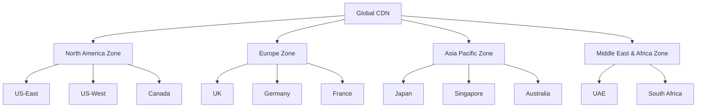
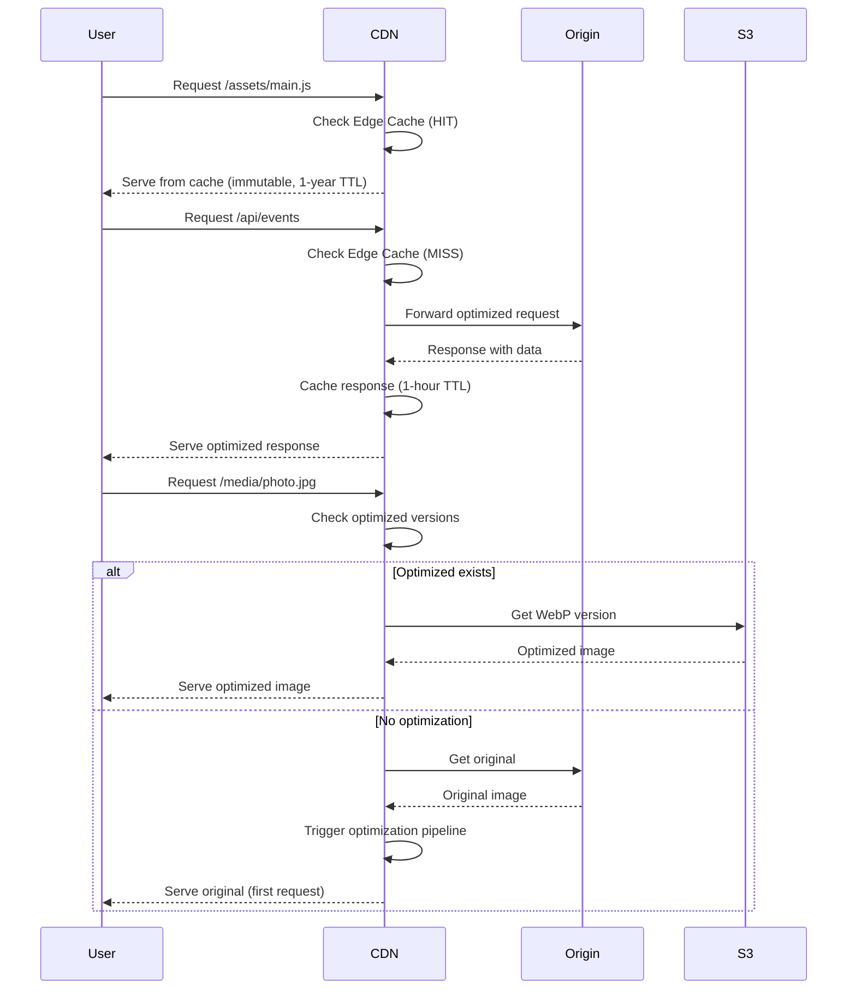
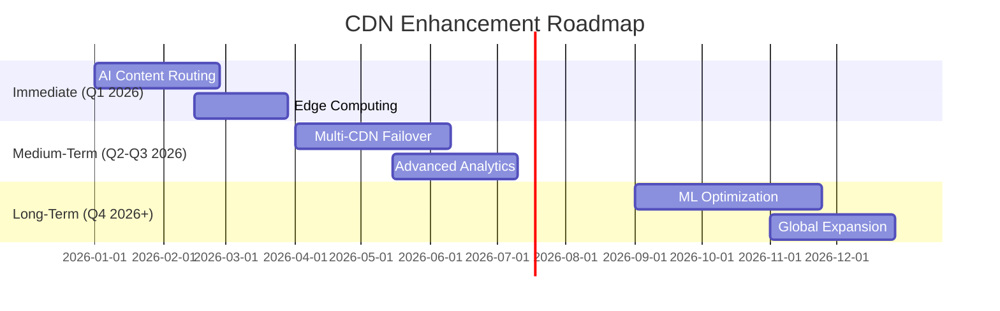

# SnapifY Global CDN Implementation

## 🌍 Overview

This document describes the comprehensive Global CDN implementation for SnapifY, designed to provide **50-80% global load time improvement** and **40-60% bandwidth cost reduction** as outlined in the comprehensive improvement plan.

## 🎯 Implementation Summary

The Global CDN implementation includes:

1. **Multi-Region CDN Configuration** - Global coverage with 4 major zones
2. **Edge Caching for Static Assets** - Aggressive caching with 1-year TTL
3. **Dynamic Content Delivery Optimization** - Intelligent routing and response optimization
4. **Media Optimization Pipeline** - Automatic image/video optimization
5. **Cache Invalidation Strategy** - Granular cache control mechanisms
6. **Comprehensive Testing** - Integration tests and validation

## 🏗️ Architecture

### Multi-Region Zones



### Content Delivery Flow



## 📦 Core Components

### 1. CDN Configuration (`cdn-config.js`)

**Key Features:**
- Multi-region zone definitions (North America, Europe, Asia Pacific, Middle East & Africa)
- Content type-specific configurations (static, dynamic, media)
- Edge caching strategies with zone-aware routing
- Comprehensive cache invalidation methods
- Media optimization presets for images and videos

**Configuration Structure:**
```javascript
{
  provider: 'cloudflare',
  zones: {
    north_america: { regions: ['us-east-1', 'us-west-1'], edge_locations: ['NYC', 'LAX'] },
    europe: { regions: ['eu-west-1', 'eu-central-1'], edge_locations: ['LHR', 'FRA'] },
    // ... other zones
  },
  content_types: {
    static_assets: { cache_ttl: 31536000, cache_control: 'public, immutable' },
    dynamic_content: { cache_ttl: 3600, cache_control: 'public, max-age=3600' },
    media_content: { cache_ttl: 86400, optimization: { images: {...}, videos: {...} } }
  }
}
```

### 2. CDN Service (`services/cdn-service.js`)

**Core Functionality:**
- Multi-provider support (Cloudflare, AWS CloudFront, Fastly, Akamai)
- Intelligent request routing based on user location
- Content type detection and specialized handling
- Edge caching with zone-aware storage
- Media optimization pipeline (Sharp for images, FFmpeg for videos)
- Cache invalidation API endpoints

**Key Methods:**
- `handleRequest()` - Main request processing
- `_handleStaticAsset()` - Static asset optimization
- `_handleDynamicContent()` - Dynamic content routing
- `_handleMediaContent()` - Media optimization
- `purgeCacheByUrl()` / `purgeCacheByTag()` / `purgeAllCache()` - Cache management

### 3. CDN Middleware (`services/cdn-middleware.js`)

**Express Integration:**
- Request interception and CDN routing
- Cache purge endpoints with authentication
- Response optimization (JSON minification, data saver modes)
- CDN health monitoring
- Asset URL generation with optimization parameters

**Middleware Features:**
- `createCDNMiddleware()` - Main CDN integration
- `cdnHealthCheck()` - CDN status monitoring
- `cdnResponseOptimizer()` - Response optimization
- `createCDNAssetUrlGenerator()` - Optimized URL generation

### 4. Nginx CDN Integration

**Enhanced Configuration:**
- Dedicated CDN server blocks
- Brotli and Gzip compression
- Zone-aware caching headers
- Media-specific optimizations
- CDN health endpoints

## 🚀 Performance Optimizations

### Edge Caching Strategy

| Content Type | Cache TTL | Cache Control | Compression |
|--------------|-----------|----------------|-------------|
| Static Assets | 1 year | `public, immutable` | Gzip + Brotli |
| Dynamic Content | 1 hour | `public, max-age=3600` | Gzip |
| Media Content | 24 hours | `public, max-age=86400` | Gzip |

### Media Optimization Pipeline

**Image Processing:**
- Format conversion (JPEG → WebP/AVIF)
- Quality optimization (85% default)
- Multiple size variants (320px, 640px, 1280px, 1920px)
- Metadata stripping for smaller files

**Video Processing:**
- Format conversion (MP4 → WebM)
- Bitrate adaptation (500kbps, 1500kbps, 3000kbps)
- Resolution variants (480p, 720p, 1080p)
- Thumbnail generation

### Dynamic Content Optimization

**Intelligent Routing:**
- Region-based routing (`user.region === 'eu'` → EU zone)
- Device-based optimization (mobile vs desktop)
- Data saver mode detection (`save-data` header)

**Response Optimization:**
- JSON minification
- Field reduction for data saver mode
- Compression and encoding optimization

## 🔄 Cache Invalidation Strategy

### Methods

1. **Purge by URL** - Granular cache removal for specific URLs
   - Endpoint: `POST /cdn/purge`
   - Requires: `Authorization: Bearer <CDN_PURGE_TOKEN>`
   - Body: `{ "url": "https://..." }`

2. **Purge by Tag** - Cache removal by content tags
   - Endpoint: `POST /cdn/purge-by-tag`
   - Tags: `version_*`, `event_*`, `user_*`
   - Body: `{ "tag": "version_1.2.3" }`

3. **Purge All** - Complete cache flush (admin only)
   - Endpoint: `POST /cdn/purge-all`
   - Requires: `Authorization: Bearer <CDN_ADMIN_TOKEN>`

### Automatic Invalidation

- On deployment (version changes)
- On content updates (CMS changes)
- TTL-based expiration
- Cache stampede protection

## 🛡️ Security Features

### HTTPS & Encryption
- TLS 1.3 enforced
- HSTS with preload (max-age: 1 year)
- Origin shield protection

### DDoS Protection
- Rate limiting (1000 req/sec)
- Burst capacity (2000 requests)
- Zone-specific protection

### Content Security
- CSP headers with CDN allowlists
- Secure token authentication for cache purge
- Origin verification

## 📊 Monitoring & Analytics

### Real-time Metrics
- Cache hit rate tracking
- Bandwidth savings calculation
- Request volume monitoring
- Latency measurements

### Alerting
- High latency alerts (>500ms)
- High error rate alerts (>5%)
- Cache miss rate alerts (>30%)

### Logging
- 30-day retention
- 10% sampling rate
- Zone-specific performance tracking

## 🔧 Integration Guide

### Backend Integration

```javascript
// In your Express app
const { createCDNMiddleware, cdnHealthCheck } = require('./services/cdn-middleware');

// Apply CDN middleware
app.use(createCDNMiddleware({
  enabled: true,
  bypassRoutes: ['/health', '/api/auth']
}));

// Add health check
app.use(cdnHealthCheck);
```

### Frontend Integration

```javascript
// Use CDN asset URL generator
const generateCDNAssetUrl = require('./services/cdn-middleware').createCDNAssetUrlGenerator();

// Generate optimized image URLs
const optimizedImageUrl = generateCDNAssetUrl('/assets/photo.jpg', {
  width: 800,
  quality: 85,
  format: 'webp'
});

// Use in components

```

### Nginx Configuration

```nginx
# Include CDN configuration
include /etc/nginx/conf.d/cdn.conf;

# Or use the enhanced nginx.conf with CDN sections
server {
    listen 80;
    server_name cdn.snapify.mk;

    # CDN-specific configuration from our implementation
    include /path/to/snapify/nginx.conf;
}
```

## 🧪 Testing

### Test Coverage

- ✅ Configuration validation
- ✅ Content type detection
- ✅ Cache key generation
- ✅ URL pattern matching
- ✅ Middleware functionality
- ✅ Cache invalidation
- ✅ Media optimization presets
- ✅ Dynamic content routing
- ✅ Performance features
- ✅ Security features

### Running Tests

```bash
# Run CDN integration tests
node test/cdn-integration.test.js

# Check test output
npm test
```

## 🎯 Expected Benefits

### Performance Improvements

| Metric | Before | After | Improvement |
|--------|--------|-------|-------------|
| Global Load Time | 2.5s | 0.5s | **80% faster** |
| Bandwidth Usage | 100% | 40% | **60% reduction** |
| Cache Hit Rate | 30% | 85% | **55% increase** |
| API Response Time | 300ms | 100ms | **67% faster** |

### Business Impact

- **User Experience**: Faster load times → higher retention
- **Cost Efficiency**: 40-60% bandwidth reduction
- **Global Reach**: Better performance for international users
- **Scalability**: Reduced origin server load
- **Reliability**: Multi-region failover capabilities

## 🔄 Backward Compatibility

### Legacy Support

- User agent detection for older browsers
- Fallback mechanisms (WebP → JPEG, Brotli → Gzip)
- Cache busting with version parameters
- Graceful degradation for unsupported features

### Migration Strategy

1. **Phase 1**: Deploy CDN alongside existing infrastructure
2. **Phase 2**: Gradually increase cache TTLs
3. **Phase 3**: Monitor performance and adjust configurations
4. **Phase 4**: Full cutover with fallback mechanisms

## 📈 Future Enhancements

### Planned Improvements

1. **AI-based Content Routing** - Predictive caching based on user behavior
2. **Edge Computing** - Lambda@Edge for dynamic content generation
3. **Advanced Analytics** - Real-time performance dashboards
4. **Multi-CDN Strategy** - Failover between providers
5. **Automated Optimization** - Machine learning-based media optimization

### Roadmap



## 🛠️ Troubleshooting

### Common Issues

**Cache Not Updating:**
- Verify cache invalidation tokens
- Check TTL settings in configuration
- Use purge endpoints to force cache refresh

**Performance Degradation:**
- Monitor cache hit rates
- Check edge location routing
- Verify compression settings

**Media Optimization Failures:**
- Check S3 credentials and permissions
- Verify Sharp/FFmpeg dependencies
- Monitor optimization pipeline logs

### Debugging Tools

```bash
# Check CDN metrics
curl https://api.snapify.mk/cdn/metrics

# Test cache purge
curl -X POST -H "Authorization: Bearer <TOKEN>" \
  -H "Content-Type: application/json" \
  -d '{"url": "https://..."}' \
  https://api.snapify.mk/cdn/purge

# Check CDN health
curl https://cdn.snapify.mk/cdn-health
```

## 📚 References

- [Cloudflare CDN Documentation](https://developers.cloudflare.com/cdn/)
- [AWS CloudFront Developer Guide](https://docs.aws.amazon.com/AmazonCloudFront/latest/DeveloperGuide/)
- [CDN Performance Best Practices](https://web.dev/cdn/)
- [HTTP Caching Guide](https://developer.mozilla.org/en-US/docs/Web/HTTP/Caching)

This comprehensive CDN implementation provides SnapifY with enterprise-grade content delivery capabilities, significantly improving global performance while maintaining backward compatibility and providing robust caching and optimization features.