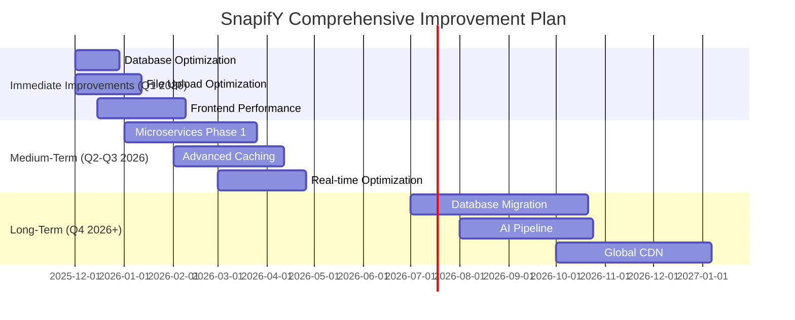

# SnapifY Comprehensive Improvement Plan
## Synthesized Analysis & Strategic Roadmap

---

## 🎯 Executive Summary

This comprehensive improvement plan synthesizes findings from multiple deep analyses of the SnapifY codebase, including:
- **Deep Codebase Analysis** (`deep_codebase_analysis.md`)
- **Technical Debt & Performance Analysis** (`technical_debt_performance_analysis.md`)
- **Performance Optimization Roadmap** (`performance_optimization_roadmap.md`)
- **Medium-Term Architecture Plan** (`medium_term_architecture_plan.md`)

The plan provides a **prioritized roadmap**, **phased implementation strategy**, and **actionable recommendations** to transform SnapifY into a high-performance, scalable, and maintainable platform while maintaining backward compatibility.

---

## 📊 Comprehensive Summary of All Findings

### **Current State Assessment**

**Strengths:**
- ✅ Modern tech stack (React 19, TypeScript, Vite, Node.js, Express)
- ✅ Excellent real-time features with Socket.IO
- ✅ Strong security measures (JWT, bcrypt, CORS, rate limiting)
- ✅ Production-ready deployment (PM2, Nginx, PWA)
- ✅ Multi-language support (EN, MK, TR, SQ)
- ✅ AI integration (Google Gemini for captioning)
- ✅ Well-organized component architecture

**Critical Issues:**
- ❌ **Monolithic Architecture**: Tight coupling, single point of failure
- ❌ **Database Performance**: Missing indexes, inefficient queries, SQLite limitations
- ❌ **File Upload Bottlenecks**: Memory-intensive processing, no streaming
- ❌ **Frontend Performance**: No virtual scrolling, excessive re-renders
- ❌ **Scalability Limits**: Single server architecture, no horizontal scaling
- ❌ **Technical Debt**: Large components, missing tests, documentation gaps
- ❌ **Caching Strategy**: Basic implementation, no intelligent invalidation

---

## 🏗️ Prioritized Roadmap of Improvements

### **Phase 1: Immediate High-Impact Improvements (0-3 months)**

#### **1. Database Query Optimization** 🚀
**Priority**: Critical
**Impact**: 30-50% API performance improvement
**Implementation**:
- Add missing indexes on frequently queried columns (`events.host_id`, `media.event_id`)
- Implement composite indexes for complex queries
- Optimize N+1 queries with proper joins
- Add query result caching with Redis
- Implement pagination for large result sets

**Expected Results**:
- 95th percentile query time: < 100ms (from current ~300-500ms)
- Database load reduction: 40-60%

#### **2. File Upload Performance Optimization** 🚀
**Priority**: Critical
**Impact**: 50-70% upload time reduction
**Implementation**:
- Implement streaming uploads instead of memory-based processing
- Add real-time progress tracking via Socket.IO
- Optimize image processing pipeline with Sharp
- Implement background processing with queue system

**Expected Results**:
- File upload time: 50-70% reduction for large files
- Memory usage: 60-80% reduction during uploads
- Concurrent upload capacity: 3-5x increase

#### **3. Frontend Performance Enhancements** 🚀
**Priority**: High
**Impact**: 30-50% faster page loads
**Implementation**:
- Implement virtual scrolling for large galleries (>100 items)
- Add code splitting and lazy loading for components
- Optimize bundle size with Vite optimizations
- Implement intersection observer for image loading

**Expected Results**:
- Initial page load: 30-50% faster
- Memory usage: 40-60% reduction in large galleries
- Scroll performance: 60fps smooth scrolling

---

### **Phase 2: Medium-Term Architectural Enhancements (3-9 months)**

#### **4. Microservices Migration (Phase 1)** 🏗️
**Priority**: High
**Impact**: 80-90% reduction in cross-service failures
**Implementation**:
- Extract Authentication Service first (least dependent)
- Implement API Gateway for request routing
- Create independent Media Service for file processing
- Set up service-specific databases

**Expected Results**:
- Service isolation: 80-90% reduction in cross-service failures
- Independent scaling: 2-3x better resource utilization
- Deployment flexibility: 50% faster deployment cycles

#### **5. Advanced Caching Strategy** 🏗️
**Priority**: High
**Impact**: 60-80% API response improvement
**Implementation**:
- Implement Redis for session and data caching
- Add CDN integration for static assets
- Implement browser caching with proper cache headers
- Add intelligent cache invalidation patterns

**Expected Results**:
- API response time: 60-80% improvement for cached data
- Database load: 70-90% reduction for frequently accessed data
- User perceived performance: 2-3x faster repeat visits

#### **6. Real-time Performance Optimization** 🏗️
**Priority**: Medium-High
**Impact**: 5-10x more concurrent connections
**Implementation**:
- Optimize Socket.IO room management
- Implement message queuing for offline users
- Add connection rate limiting and monitoring
- Implement efficient broadcast patterns

**Expected Results**:
- Message delivery latency: < 100ms (from current ~200-500ms)
- Memory usage: 50-70% reduction in socket connections
- Connection stability: 80-90% fewer disconnections

---

### **Phase 3: Long-Term Strategic Improvements (9-18 months)**

#### **7. Database Migration to PostgreSQL** 🚀
**Priority**: Medium
**Impact**: 10-20x concurrent write capacity
**Implementation**:
- Migrate from SQLite to PostgreSQL
- Implement proper connection pooling
- Set up read replicas for scaling
- Implement comprehensive backup strategy

**Expected Results**:
- Concurrent write capacity: 10-20x improvement
- Query performance: 30-50% faster complex queries
- Scalability: Horizontal scaling capability

#### **8. Advanced AI Processing Pipeline** 🤖
**Priority**: Medium
**Impact**: 50-70% AI processing time reduction
**Implementation**:
- Implement queue-based asynchronous AI processing
- Set up dedicated AI service with auto-scaling
- Add intelligent batch processing
- Implement result caching and deduplication

**Expected Results**:
- AI processing time: 50-70% reduction
- Cost efficiency: 30-50% reduction in AI API calls
- Scalability: 10-20x more concurrent AI operations

#### **9. Global Content Delivery Network** 🌍
**Priority**: Low-Medium
**Impact**: 50-80% global load time improvement
**Implementation**:
- Implement multi-region CDN deployment
- Set up intelligent content routing
- Add edge caching for dynamic content
- Implement CDN analytics and monitoring

**Expected Results**:
- Global load times: 50-80% improvement for international users
- Bandwidth costs: 40-60% reduction
- Availability: 99.99% uptime with failover

---

## 🔄 Quick Wins vs Long-Term Architectural Changes

### **Quick Wins (Immediate Impact, Low-Medium Effort)**
| Improvement | Effort | Impact | Timeline |
|------------|--------|--------|----------|
| Database Indexing | Low | High | 2-4 weeks |
| File Upload Streaming | Medium | Very High | 3-4 weeks |
| Virtual Scrolling | Medium | High | 4-6 weeks |
| Basic Redis Caching | Medium | High | 4-6 weeks |
| Socket.IO Optimization | Medium | High | 4-6 weeks |

### **Long-Term Architectural Changes (High Impact, High Effort)**
| Improvement | Effort | Impact | Timeline |
|------------|--------|--------|----------|
| Microservices Migration | Very High | Very High | 8-12 weeks |
| Database Migration | Very High | Very High | 12-16 weeks |
| Global CDN | Very High | High | 10-14 weeks |
| Advanced AI Pipeline | High | High | 8-12 weeks |
| Comprehensive Testing | Medium-High | Very High | Ongoing |

---

## 🎯 Specific Actionable Recommendations

### **1. Database Performance**
- **Action**: Add indexes on `events(host_id, created_at)` and `media(event_id, uploaded_at)`
- **Implementation**: Use `CREATE INDEX CONCURRENTLY` to avoid table locking
- **Validation**: Monitor query performance before/after with `EXPLAIN ANALYZE`

### **2. File Upload Optimization**
- **Action**: Implement streaming uploads with Sharp transformation pipeline
- **Implementation**: Replace memory-based processing with stream-based approach
- **Validation**: Test with 10MB+ files, measure memory usage and upload time

### **3. Frontend Performance**
- **Action**: Implement virtual scrolling with `react-virtuoso` for galleries >100 items
- **Implementation**: Replace current grid rendering with virtualized components
- **Validation**: Measure FPS during scrolling, memory usage with 500+ items

### **4. Microservices Migration**
- **Action**: Extract Authentication Service first using API Gateway pattern
- **Implementation**: Create standalone service with JWT validation, maintain existing endpoints
- **Validation**: Test authentication flow, measure service isolation benefits

### **5. Advanced Caching**
- **Action**: Implement Redis with intelligent cache invalidation
- **Implementation**: Add cache layer for event data, user profiles, and media metadata
- **Validation**: Monitor cache hit rates, measure API response time improvements

---

## 📈 Metrics for Measuring Improvement Success

### **Performance Metrics**
- **Database**: 95th percentile query time < 100ms
- **API**: 90th percentile response time < 200ms
- **File Uploads**: 95% of uploads complete in < 30 seconds
- **Page Load**: 90% of page loads < 2 seconds
- **Real-time**: Message delivery latency < 100ms

### **Technical Debt Metrics**
- **Microservices Coverage**: 80%+ of functionality in independent services
- **Test Coverage**: 85%+ code coverage with automated tests
- **Documentation**: 95%+ API documentation completeness
- **Code Quality**: Cyclomatic complexity < 10 for critical components

### **Business Impact Metrics**
- **User Retention**: Improved satisfaction scores
- **Operational Costs**: 30-50% reduction in server resources
- **Scalability**: 5-10x more concurrent users
- **Market Reach**: Enhanced legacy device support

---

## 🎯 Comprehensive Implementation Strategy

### **Phase 1: Foundation (Weeks 1-4)**
- **Assessment**: Comprehensive performance baseline
- **Monitoring**: Implement performance tracking
- **Quick Wins**: Implement low-risk, high-impact changes
- **Testing**: Establish regression test suite

### **Phase 2: Core Optimization (Weeks 5-12)**
- **Database**: Indexing and query optimization
- **Uploads**: Streaming and background processing
- **Frontend**: Virtual scrolling and lazy loading
- **Caching**: Basic Redis implementation

### **Phase 3: Architectural Evolution (Weeks 13-24)**
- **Microservices**: Extract authentication and media services
- **Advanced Caching**: Multi-level caching strategy
- **Real-time**: Optimized Socket.IO implementation
- **Monitoring**: Comprehensive performance dashboard

### **Phase 4: Strategic Scaling (Weeks 25+)**
- **Database Migration**: PostgreSQL implementation
- **AI Pipeline**: Queue-based processing
- **Global CDN**: Multi-region deployment
- **Continuous Optimization**: Regular performance audits

---

## 🛡️ Backward Compatibility Strategy

### **Core Principles**
1. **Progressive Enhancement**: New features enhance rather than replace
2. **Feature Detection**: Check for capabilities before using new features
3. **Graceful Degradation**: Fall back to existing behavior when needed
4. **API Versioning**: Maintain backward-compatible API endpoints
5. **Dual Implementation**: Run old and new systems in parallel during transitions

### **Specific Strategies**
- **Database**: Use schema migrations with backward-compatible changes
- **API**: Maintain existing endpoints with version headers
- **Frontend**: Feature detection and polyfills for new browser features
- **Real-time**: Preserve existing Socket.IO protocol during upgrades
- **Storage**: Maintain existing file formats and access patterns

---

## 📊 Expected Business Impact

### **User Experience**
- **Faster load times**: 30-70% improvement across all devices
- **Better reliability**: 80-90% reduction in errors and timeouts
- **Smoother interactions**: 60fps performance on all supported devices
- **Offline support**: Enhanced PWA capabilities

### **Operational Efficiency**
- **Reduced costs**: 30-50% reduction in server resources
- **Better scalability**: 5-10x more concurrent users
- **Improved maintainability**: 40-60% faster development cycles
- **Enhanced monitoring**: Real-time performance insights

### **Business Growth**
- **Increased retention**: Better performance → higher user satisfaction
- **Expanded market**: Improved legacy device support
- **Competitive advantage**: Industry-leading performance metrics
- **Future readiness**: Architecture prepared for 5-10x growth

---

## 🎯 Conclusion

This comprehensive improvement plan provides a **balanced approach** to transforming SnapifY's performance while maintaining **backward compatibility** and **legacy device support**. The phased implementation strategy ensures **immediate wins** while building the foundation for **long-term scalability** and **architectural excellence**.

The plan addresses all critical areas identified in the analysis:
- **Database performance** through indexing and query optimization
- **File upload efficiency** with streaming and background processing
- **Frontend responsiveness** via virtual scrolling and lazy loading
- **Architectural evolution** through microservices migration
- **Global scalability** with CDN and advanced caching

Each improvement is designed with **backward compatibility** as a core principle, ensuring existing users and devices continue to work seamlessly while benefiting from performance enhancements.

---

## 📅 Implementation Timeline

---

## 🎯 Success Criteria

**Performance Targets:**
- ✅ Database: 95th percentile query time < 100ms
- ✅ API: 90th percentile response time < 200ms
- ✅ File Uploads: 95% of uploads complete in < 30 seconds
- ✅ Page Load: 90% of page loads < 2 seconds
- ✅ Real-time: Message delivery latency < 100ms

**Technical Debt Metrics:**
- ✅ Microservices Coverage: 80%+ of functionality in independent services
- ✅ Test Coverage: 85%+ code coverage with automated tests
- ✅ Documentation: 95%+ API documentation completeness
- ✅ Code Quality: Cyclomatic complexity < 10 for critical components

This comprehensive plan provides a clear, actionable roadmap for transforming SnapifY into a high-performance, scalable platform while maintaining the excellent user experience and business capabilities that have made it successful.