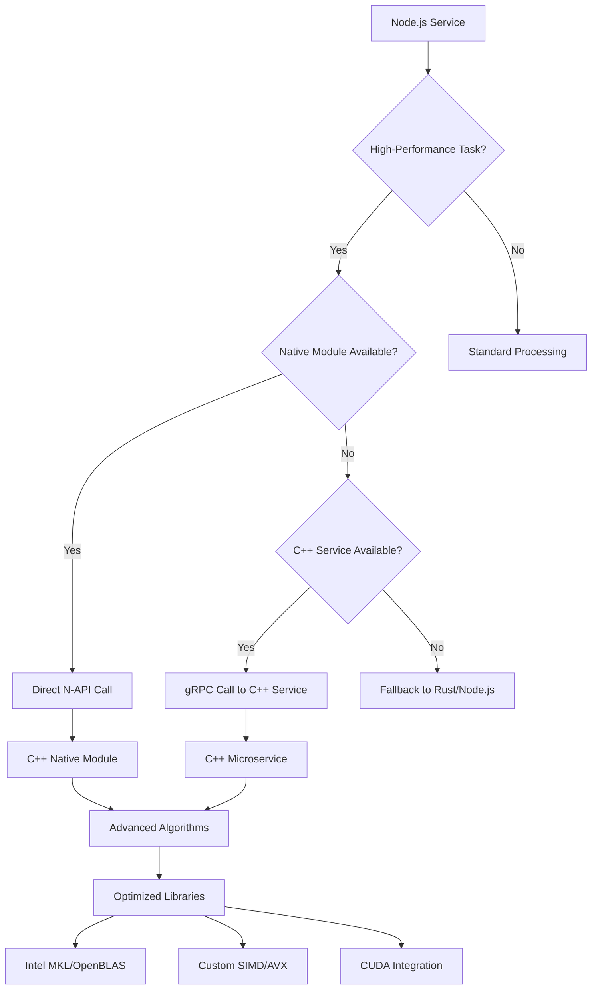

# C++ Integration Strategy for Snapify

## Executive Summary

This document outlines a practical strategy for integrating C++ into the Snapify web application to enhance performance for high-performance backend systems, infrastructure, and core services, particularly for image processing and data-intensive tasks.

## Current Architecture Analysis

### Existing Performance Landscape
- **Frontend**: React/TypeScript PWA
- **Backend**: Node.js/Express with partial microservices
- **Image Processing**: Rust with CUDA acceleration (RTX 3090)
- **Storage**: S3-compatible, Redis caching
- **Real-time**: WebSocket with Redis adapter

### Identified Integration Points
1. **Media Service**: High-performance image processing beyond CUDA capabilities
2. **Data Processing**: Batch analytics and heavy computations
3. **Infrastructure Services**: Low-level optimizations and custom networking
4. **Core Services**: Memory-intensive operations requiring maximum performance

## Use Cases for C++

### 1. Advanced Image Processing
- **HDR Processing**: Tone mapping, exposure fusion
- **AI/ML Inference**: Custom computer vision algorithms
- **Video Processing**: Frame extraction, motion analysis
- **Format Optimization**: Lossless compression algorithms

### 2. High-Performance Data Processing
- **Batch Analytics**: Real-time event statistics computation
- **Data Compression**: Custom algorithms for large datasets
- **Cryptographic Operations**: High-throughput encryption/decryption
- **Search Indexing**: Full-text search with custom ranking

### 3. Infrastructure Optimization
- **Custom Networking**: Optimized TCP/UDP protocols
- **Memory Management**: Advanced caching strategies
- **Thread Pool Management**: Fine-grained concurrency control
- **System Resource Monitoring**: Low-level performance metrics

### 4. Real-time Processing
- **Live Stream Processing**: Real-time video effects
- **Audio Processing**: Voice enhancement, noise reduction
- **Sensor Data Fusion**: Multi-source data integration
- **Real-time Analytics**: Streaming data processing

## Integration Methods

### Method 1: Native Module (N-API)
**Best for**: Direct integration with Node.js services

```cpp
// cpp_processor/include/processor.h
#ifndef PROCESSOR_H
#define PROCESSOR_H

#include <napi.h>
#include <memory>
#include <vector>

class ImageProcessor : public Napi::ObjectWrap<ImageProcessor> {
public:
    static Napi::Object Init(Napi::Env env, Napi::Object exports);
    ImageProcessor(const Napi::CallbackInfo& info);

private:
    Napi::Value ProcessImage(const Napi::CallbackInfo& info);
    Napi::Value GetPerformanceMetrics(const Napi::CallbackInfo& info);

    std::unique_ptr<AdvancedProcessor> processor_;
};

#endif
```

```cpp
// cpp_processor/src/processor.cc
#include "processor.h"
#include <iostream>

Napi::Object ImageProcessor::Init(Napi::Env env, Napi::Object exports) {
    Napi::Function func = DefineClass(env, "ImageProcessor", {
        InstanceMethod("processImage", &ImageProcessor::ProcessImage),
        InstanceMethod("getPerformanceMetrics", &ImageProcessor::GetPerformanceMetrics)
    });

    exports.Set("ImageProcessor", func);
    return exports;
}

Napi::Value ImageProcessor::ProcessImage(const Napi::CallbackInfo& info) {
    Napi::Env env = info.Env();

    if (info.Length() < 2) {
        Napi::TypeError::New(env, "Wrong number of arguments").ThrowAsJavaScriptException();
        return env.Null();
    }

    // Extract buffer and options
    Napi::Buffer<uint8_t> inputBuffer = info[0].As<Napi::Buffer<uint8_t>>();
    Napi::Object options = info[1].As<Napi::Object>();

    // Process image with C++ implementation
    auto result = processor_->processImage(
        inputBuffer.Data(),
        inputBuffer.Length(),
        options
    );

    // Return processed buffer
    return Napi::Buffer<uint8_t>::Copy(env, result.data(), result.size());
}
```

### Method 2: Separate Service (gRPC)
**Best for**: Scalable, language-agnostic services

```protobuf
// proto/image_service.proto
syntax = "proto3";

service ImageService {
  rpc ProcessImage (ImageRequest) returns (ImageResponse);
  rpc BatchProcess (BatchRequest) returns (BatchResponse);
  rpc GetMetrics (MetricsRequest) returns (MetricsResponse);
}

message ImageRequest {
  bytes image_data = 1;
  string operation = 2;
  map<string, string> parameters = 3;
}

message ImageResponse {
  bytes processed_data = 1;
  double processing_time = 2;
  string status = 3;
}
```

```cpp
// cpp_service/src/image_service.cc
#include <grpcpp/grpcpp.h>
#include "image_service.grpc.pb.h"

class ImageServiceImpl final : public ImageService::Service {
    grpc::Status ProcessImage(
        grpc::ServerContext* context,
        const ImageRequest* request,
        ImageResponse* response) override {

        // High-performance C++ processing
        auto result = processor_.processImage(
            request->image_data(),
            request->operation(),
            request->parameters()
        );

        response->set_processed_data(result.data, result.size);
        response->set_processing_time(result.time_ms);
        response->set_status("success");

        return grpc::Status::OK;
    }
};
```

### Method 3: Hybrid Approach
**Best for**: Maximum performance with Node.js integration

```cpp
// Hybrid integration combining N-API and gRPC
class HybridProcessor {
private:
    std::unique_ptr<grpc::Channel> channel_;
    std::unique_ptr<ImageService::Stub> stub_;

public:
    HybridProcessor() {
        // Connect to C++ service
        channel_ = grpc::CreateChannel("localhost:50051",
                                     grpc::InsecureChannelCredentials());
        stub_ = ImageService::NewStub(channel_);
    }

    Napi::Value ProcessImageHybrid(const Napi::CallbackInfo& info) {
        // Fast path: direct C++ processing for small images
        if (isSmallImage(info)) {
            return processDirectly(info);
        }

        // Slow path: delegate to service for large images
        return processViaService(info);
    }
};
```

## Architectural Diagram



## Performance Advantages

### 1. Computational Performance
- **SIMD/AVX Instructions**: 4-8x speedup for vector operations
- **Memory Management**: Zero-copy operations, custom allocators
- **Cache Optimization**: Data structure alignment, prefetching
- **Algorithm Optimization**: Platform-specific implementations

### 2. Resource Efficiency
- **Memory Usage**: Precise control over allocations
- **CPU Utilization**: Fine-grained thread management
- **I/O Optimization**: Direct system calls, custom buffering
- **Power Management**: Hardware-specific optimizations

### 3. Scalability Benefits
- **Concurrent Processing**: Lock-free algorithms
- **NUMA Awareness**: Multi-socket optimization
- **Network Stack**: Custom protocols for high throughput
- **Storage Optimization**: Direct filesystem operations

## Trade-offs and Considerations

### Development Complexity
- **Compilation Time**: Longer build cycles
- **Debugging**: More complex than interpreted languages
- **Memory Safety**: Manual management increases risk
- **Cross-Platform**: Platform-specific code required

### Operational Challenges
- **Deployment**: Native binaries for each platform
- **Monitoring**: Limited introspection capabilities
- **Updates**: Requires recompilation for changes
- **Dependencies**: Complex dependency management

### Integration Overhead
- **Interoperability**: N-API/gRPC adds latency
- **Serialization**: Data conversion between languages
- **Error Handling**: Exception propagation across boundaries
- **Version Compatibility**: ABI compatibility concerns

### Cost Considerations
- **Development Time**: Higher expertise requirements
- **Maintenance**: Specialized knowledge needed
- **Testing**: More complex testing scenarios
- **Infrastructure**: Additional build/deployment complexity

## Implementation Roadmap

### Phase 1: Foundation (Weeks 1-2)
- Set up C++ development environment
- Implement basic N-API bindings
- Create performance benchmarks
- Establish coding standards

### Phase 2: Core Services (Weeks 3-6)
- Image processing enhancements
- Data compression algorithms
- Basic service architecture
- Integration testing

### Phase 3: Advanced Features (Weeks 7-10)
- AI/ML inference capabilities
- Real-time processing pipelines
- Distributed processing support
- Performance optimization

### Phase 4: Production (Weeks 11-12)
- Monitoring and observability
- Automated deployment
- Documentation and training
- Production validation

## Success Metrics

### Performance Targets
- **Latency**: < 50ms for image processing operations
- **Throughput**: 1000+ operations per second
- **Memory Efficiency**: < 100MB per concurrent operation
- **CPU Utilization**: < 80% under normal load

### Reliability Goals
- **Uptime**: 99.95% service availability
- **Error Rate**: < 0.1% processing failures
- **Fallback Success**: 100% graceful degradation
- **Recovery Time**: < 30 seconds after failures

### Development Metrics
- **Build Time**: < 5 minutes for incremental builds
- **Test Coverage**: > 90% code coverage
- **Integration Tests**: All critical paths tested
- **Documentation**: Complete API documentation

## Risk Mitigation

### Technical Risks
- **Memory Leaks**: Implement RAII patterns, smart pointers
- **Thread Safety**: Use thread-safe data structures
- **ABI Compatibility**: Version N-API carefully
- **Platform Differences**: Abstract platform-specific code

### Operational Risks
- **Build Failures**: Automated CI/CD pipelines
- **Deployment Issues**: Blue-green deployment strategy
- **Performance Regression**: Continuous benchmarking
- **Security Vulnerabilities**: Regular security audits

### Team Risks
- **Skill Gaps**: Training and knowledge sharing
- **Code Reviews**: Mandatory C++ expertise reviews
- **Documentation**: Comprehensive coding standards
- **Pair Programming**: Knowledge transfer sessions

## Conclusion

C++ integration offers significant performance advantages for Snapify's high-performance requirements, particularly in image processing and data-intensive tasks. The hybrid approach combining N-API for direct integration and gRPC for service isolation provides flexibility and scalability.

Key recommendations:
1. Start with N-API for direct Node.js integration
2. Focus on image processing enhancements first
3. Implement comprehensive fallback mechanisms
4. Establish strong testing and monitoring practices
5. Plan for gradual rollout with performance validation

The strategy balances performance gains with development complexity, ensuring maintainable and reliable integration.