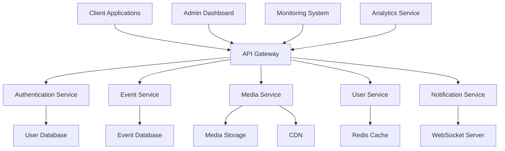
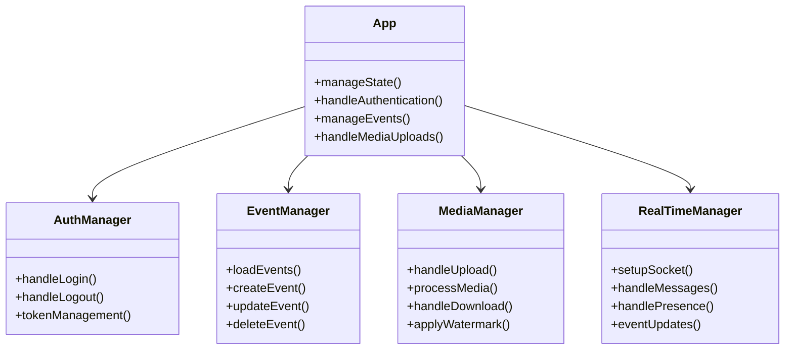
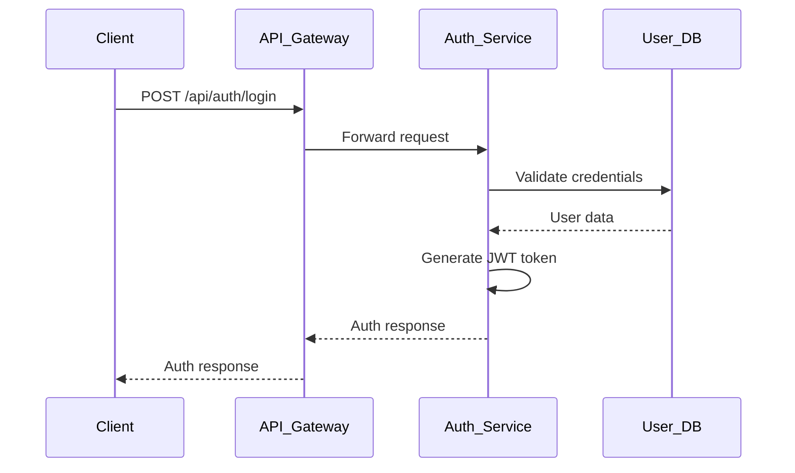
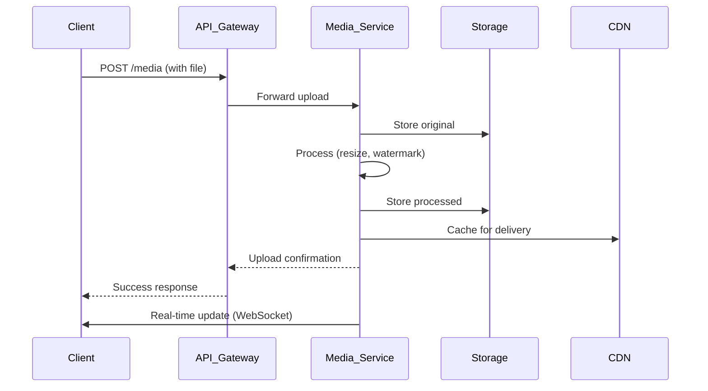
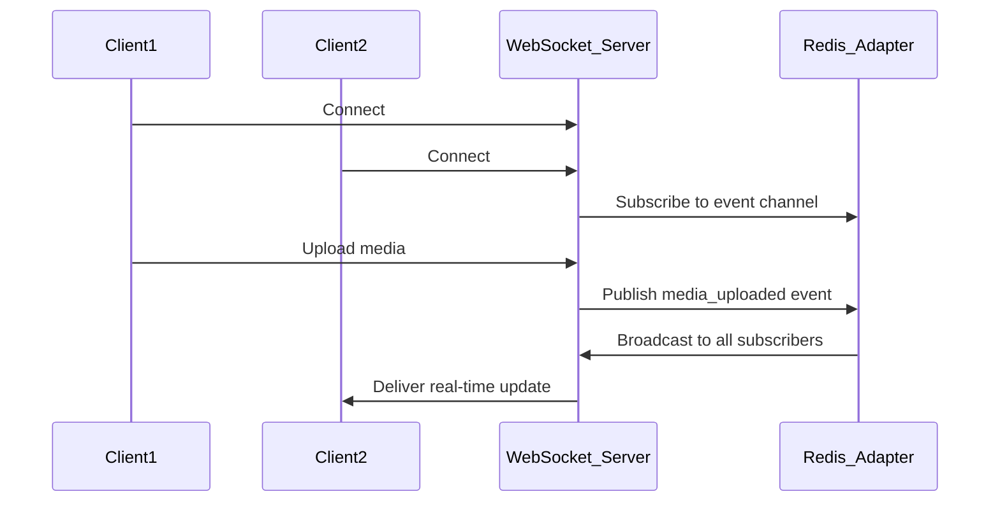
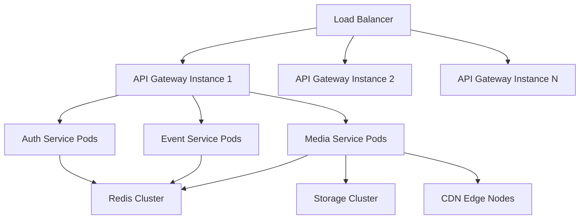

# SnapifY Comprehensive System Architecture Documentation

## 🎯 Executive Summary

This document provides a comprehensive technical architecture overview of SnapifY, covering system design, component architecture, data flow, technology stack, integration points, performance considerations, and security architecture.

---

## 🏗️ 1. System Overview and High-Level Architecture

### **1.1 System Purpose**
SnapifY is a real-time event sharing platform that enables users to create events, collect photos/videos from guests, and share memories without requiring app downloads. The system supports multiple user roles, tiered pricing, and advanced features like AI captioning, watermarking, and live slideshows.

### **1.2 High-Level Architecture Diagram**



### **1.3 Core System Components**

1. **Client Applications**: Web-based PWA with React/TypeScript
2. **API Gateway**: Central entry point for all requests
3. **Microservices**: Authentication, User, Event, Media, Notification services
4. **Data Storage**: SQLite databases, Redis caching, S3-compatible storage
5. **Real-time Infrastructure**: WebSocket server with Redis adapter
6. **Monitoring**: Performance tracking, health checks, alerting

---

## 📚 2. Detailed Component Architecture

### **2.1 Frontend Architecture**

#### **Main Application Structure**
- **App.tsx**: Core application component (1,578 lines)
- **Component Hierarchy**: Modular design with lazy-loaded components
- **State Management**: React hooks + Context API
- **Routing**: View-based navigation (landing, dashboard, event, admin, live)

#### **Key Frontend Components**



### **2.2 Backend Architecture**

#### **Microservices Design**

1. **Authentication Service**
   - JWT token management
   - Google OAuth integration
   - Session management
   - Token validation/refresh

2. **User Service**
   - User CRUD operations
   - Role-based access control
   - User profile management
   - Storage quota tracking

3. **Event Service**
   - Event creation/management
   - Event access control (PIN validation)
   - Event statistics tracking
   - Expiration handling

4. **Media Service**
   - Media upload/processing
   - Storage management
   - Metadata handling
   - Privacy controls

5. **Notification Service**
   - Real-time notifications
   - Email/push notifications
   - Notification preferences
   - History tracking

#### **API Gateway**
- Request routing & load balancing
- Authentication/authorization
- Rate limiting & caching
- Request/response transformation

---

## 🔄 3. Data Flow Architecture

### **3.1 User Authentication Flow**



### **3.2 Media Upload Flow**



### **3.3 Real-time Event Updates**



---

## 💻 4. Technology Stack Documentation

### **4.1 Frontend Stack**
- **Framework**: React 19.2.0 with TypeScript
- **State Management**: React hooks + Context API
- **Styling**: Tailwind CSS 4.1.17
- **UI Components**: Custom components with lazy loading
- **Internationalization**: Multi-language support (EN, MK, TR, SQ)
- **PWA**: Progressive Web App with service workers
- **Build Tool**: Vite 5.4.0

### **4.2 Backend Stack**
- **Runtime**: Node.js with TypeScript
- **Framework**: Express.js 5.1.0
- **Database**: SQLite 5.1.7 (with PostgreSQL migration planned)
- **Caching**: Redis 5.10.0
- **Storage**: AWS S3-compatible
- **Real-time**: Socket.IO 4.8.1 with Redis adapter
- **Authentication**: JWT with Google OAuth
- **API Documentation**: OpenAPI/Swagger

### **4.3 Infrastructure Stack**
- **Containerization**: PM2 process management
- **Web Server**: Nginx
- **CI/CD**: Custom deployment scripts
- **Monitoring**: Performance dashboard integration
- **Logging**: Winston 3.18.3
- **Error Tracking**: Sentry 10.27.0

### **4.4 Development Tooling**
- **Testing**: Jest 30.2.0, Playwright 1.44.1
- **Linting**: ESLint, Prettier
- **Code Quality**: TypeScript, Jest coverage
- **Documentation**: Markdown, Mermaid diagrams
- **Version Control**: Git

---

## 🔗 5. Integration Points and Interfaces

### **5.1 External Integrations**

1. **Google Authentication**
   - OAuth 2.0 integration
   - Google Sign-In API
   - Token-based authentication

2. **AWS S3 Storage**
   - Media file storage
   - CDN distribution
   - Signed URL generation

3. **Redis Services**
   - Session caching
   - Real-time message brokering
   - Rate limiting

4. **Email Services**
   - Transactional emails
   - Notification delivery
   - Password recovery

### **5.2 Internal Service Interfaces**

#### **Authentication Service API**
```typescript
interface AuthAPI {
  POST /api/auth/login - User login
  POST /api/auth/google - Google authentication
  POST /api/auth/validate - Token validation
  POST /api/auth/refresh - Token refresh
  POST /api/auth/logout - User logout
}
```

#### **Event Service API**
```typescript
interface EventAPI {
  POST /api/events - Create event
  GET /api/events/:id - Get event details
  PUT /api/events/:id - Update event
  DELETE /api/events/:id - Delete event
  POST /api/events/:id/validate-pin - PIN validation
  POST /api/events/:id/view - Increment view count
}
```

#### **Media Service API**
```typescript
interface MediaAPI {
  POST /api/media - Upload media
  GET /api/media/:id - Get media details
  DELETE /api/media/:id - Delete media
  POST /api/media/bulk-delete - Bulk delete
  POST /api/media/like - Like media item
}
```

#### **User Service API**
```typescript
interface UserAPI {
  POST /api/users - Create user
  GET /api/users/:id - Get user details
  PUT /api/users/:id - Update user
  DELETE /api/users/:id - Delete user
  GET /api/users - List users (admin)
}
```

---

## 🚀 6. Performance and Scalability Considerations

### **6.1 Performance Optimization Strategies**

1. **Frontend Performance**
   - Code splitting with React.lazy
   - Image optimization and lazy loading
   - Virtualized lists for large datasets
   - Service worker caching
   - Progressive image loading

2. **Backend Performance**
   - Redis caching with intelligent invalidation
   - Database query optimization
   - Connection pooling
   - Batch processing for media operations
   - Background job queues

3. **Real-time Performance**
   - WebSocket message batching
   - Connection throttling
   - Adaptive compression
   - Presence management
   - Load-based scaling

### **6.2 Scalability Architecture**



### **6.3 Caching Strategy**

1. **Multi-level Caching**
   - Browser cache (Service Worker)
   - CDN edge caching
   - Redis application cache
   - Database query caching

2. **Cache Invalidation**
   - Event-based invalidation
   - Time-based expiration
   - Version-based cache keys
   - Manual admin triggers

3. **Performance Metrics**
   - Target: < 200ms API response time (90th percentile)
   - Target: < 1s page load time
   - Target: 99.9% uptime
   - Target: Handle 10x current load

---

## 🛡️ 7. Security Architecture

### **7.1 Authentication and Authorization**

1. **Authentication Flow**
   - JWT token-based authentication
   - OAuth 2.0 with Google integration
   - Secure token storage (HttpOnly cookies)
   - Token refresh mechanism
   - Session management

2. **Authorization Model**
   - Role-Based Access Control (RBAC)
   - User roles: Guest, User, Photographer, Admin
   - Resource-level permissions
   - Event access control (PIN protection)

### **7.2 Data Protection**

1. **Data Encryption**
   - TLS 1.2+ for all communications
   - Encryption at rest for sensitive data
   - Secure password hashing (bcrypt)
   - JWT token signing

2. **Input Validation**
   - Comprehensive input sanitization
   - XSS protection
   - CSRF protection
   - SQL injection prevention

3. **Security Headers**
   - CSP (Content Security Policy)
   - HSTS (HTTP Strict Transport Security)
   - X-Frame-Options
   - X-Content-Type-Options

### **7.3 Infrastructure Security**

1. **Network Security**
   - Firewall protection
   - DDoS mitigation
   - Rate limiting
   - IP filtering

2. **Monitoring and Logging**
   - Comprehensive audit logging
   - Anomaly detection
   - Security event monitoring
   - Regular security audits

3. **Incident Response**
   - Automated alerting
   - Incident response procedures
   - Security patch management
   - Vulnerability scanning

---

## 🔄 8. Backward Compatibility Strategy

### **8.1 API Versioning**
- Semantic versioning for APIs
- Deprecation policies
- Versioned endpoints
- Migration guides

### **8.2 Data Migration**
- Schema migration tools
- Data transformation pipelines
- Backward-compatible changes
- Rollback capabilities

### **8.3 Feature Flags**
- Gradual feature rollout
- A/B testing support
- User segmentation
- Performance monitoring

---

## 📊 9. Monitoring and Analytics

### **9.1 Performance Monitoring**
- Real-time metrics collection
- Service health dashboards
- User experience analytics
- Infrastructure monitoring

### **9.2 Alerting System**
- Threshold-based alerts
- Anomaly detection
- Multi-channel notifications
- Escalation policies

### **9.3 Analytics**
- User behavior tracking
- Feature usage metrics
- Performance trends
- Business intelligence

---

## 🎯 10. Deployment Architecture

### **10.1 Deployment Strategy**
- Blue-green deployments
- Canary releases
- Rollback procedures
- Health checks

### **10.2 Environment Management**
- Development environment
- Staging environment
- Production environment
- Feature branches

### **10.3 CI/CD Pipeline**
- Automated testing
- Build validation
- Deployment approvals
- Monitoring integration

---

## 📈 11. Future Architecture Evolution

### **11.1 Planned Enhancements**
1. **Microservices Maturation**
   - Complete service isolation
   - Enhanced service discovery
   - Improved resilience patterns

2. **Advanced Caching**
   - Distributed caching
   - Cache warming
   - Predictive caching

3. **Real-time Optimization**
   - WebSocket scaling
   - Message prioritization
   - Connection management

4. **Code Quality**
   - Component modularization
   - Utility centralization
   - Error handling standardization

### **11.2 Technology Roadmap**
- PostgreSQL migration
- Kubernetes orchestration
- Enhanced monitoring
- AI/ML integration
- Advanced analytics

---

## 🎯 Conclusion

This comprehensive architecture documentation provides a complete technical overview of SnapifY's system design, covering all critical aspects from high-level architecture to detailed component interactions, performance considerations, and security measures. The architecture is designed for scalability, maintainability, and robust performance while supporting the platform's core mission of real-time event sharing and memory collection.