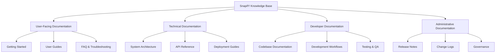
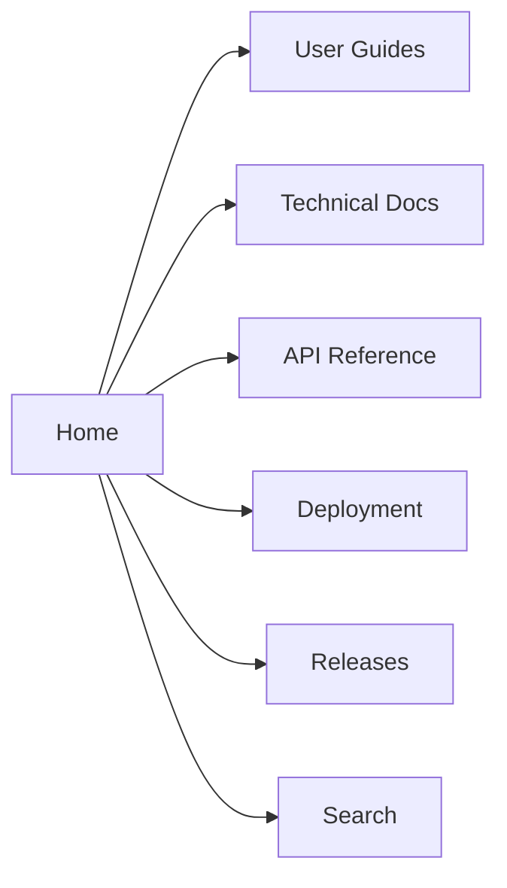
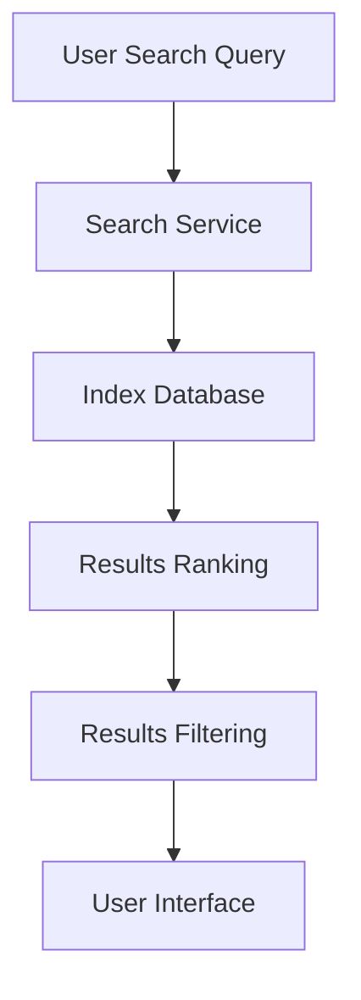
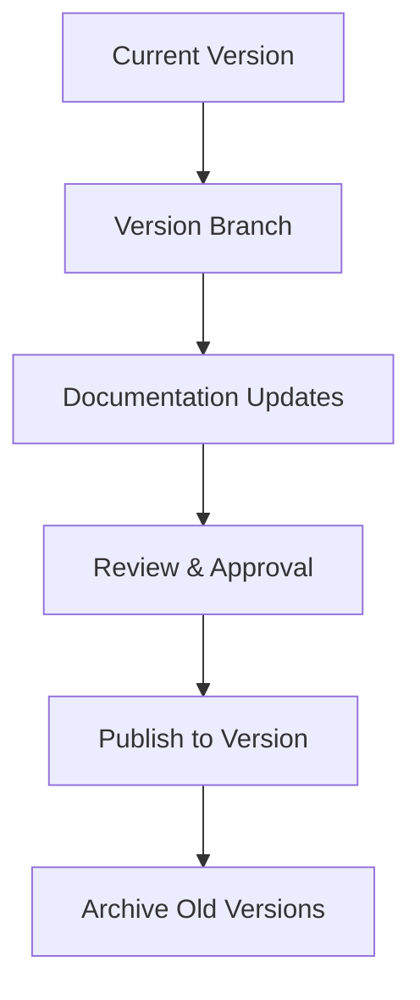
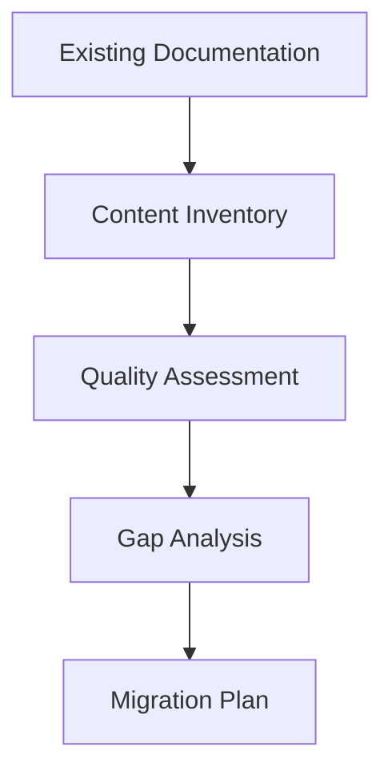
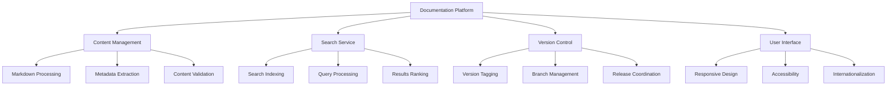
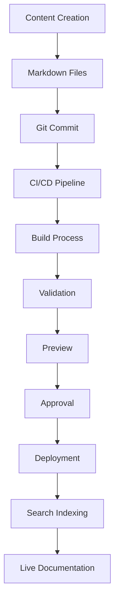
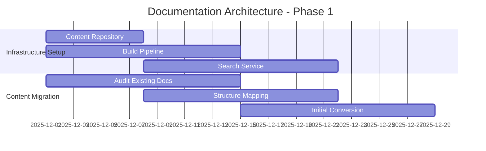
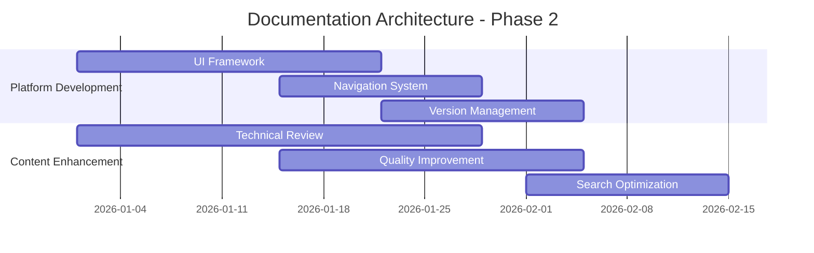
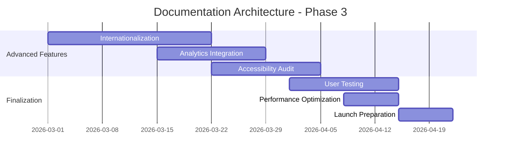

# SnapifY Comprehensive Documentation Architecture Design
## Knowledge Base Foundation & Technical Implementation

---

## 🎯 Executive Summary

This document presents a **comprehensive documentation architecture design** for SnapifY's knowledge base, addressing all six required areas: overall structure, content organization, navigation/search, versioning strategy, integration approach, and technical implementation.

---

## 🏗️ 1. Overall Structure and Organization

### **Documentation Architecture Overview**



### **Structural Principles**

1. **Modular Organization**: Separate content by audience and purpose
2. **Progressive Complexity**: From beginner to advanced topics
3. **Cross-Referencing**: Rich linking between related topics
4. **Version Awareness**: Content tagged by applicable versions

---

## 📚 2. Content Categories and Hierarchy

### **Content Taxonomy**

| Category | Subcategories | Target Audience | Update Frequency |
|----------|---------------|-----------------|------------------|
| **Getting Started** | Installation, Quick Start, First Event | New Users | Quarterly |
| **User Guides** | Event Creation, Media Management, Sharing | Regular Users | Monthly |
| **Technical Reference** | API Docs, Architecture, Performance | Developers | Per Release |
| **Deployment** | Production, Staging, Local Setup | DevOps | Per Release |
| **Troubleshooting** | Common Issues, Error Codes, Debugging | Support | Weekly |
| **Best Practices** | Performance, Security, Scalability | Advanced Users | Quarterly |
| **Release Notes** | Version Changes, Breaking Changes, Deprecations | All | Per Release |
| **Contribution** | Development Setup, Coding Standards, PR Process | Contributors | As Needed |

### **Hierarchical Content Structure**

```
📁 docs/
├── 📁 user/
│   ├── 📄 getting-started.md
│   ├── 📄 event-creation.md
│   ├── 📄 media-management.md
│   └── 📄 sharing-guide.md
│
├── 📁 technical/
│   ├── 📁 architecture/
│   │   ├── 📄 system-overview.md
│   │   ├── 📄 microservices.md
│   │   └── 📄 data-flow.md
│   │
│   ├── 📁 api/
│   │   ├── 📄 authentication.md
│   │   ├── 📄 events.md
│   │   ├── 📄 media.md
│   │   └── 📄 realtime.md
│   │
│   └── 📁 performance/
│       ├── 📄 optimization.md
│       ├── 📄 caching.md
│       └── 📄 monitoring.md
│
├── 📁 deployment/
│   ├── 📄 production.md
│   ├── 📄 staging.md
│   ├── 📄 local-development.md
│   └── 📄 troubleshooting.md
│
├── 📁 development/
│   ├── 📄 setup.md
│   ├── 📄 workflows.md
│   ├── 📄 testing.md
│   └── 📄 contribution.md
│
├── 📁 releases/
│   ├── 📄 v1.0/
│   │   ├── 📄 release-notes.md
│   │   ├── 📄 breaking-changes.md
│   │   └── 📄 migration-guide.md
│   │
│   └── 📄 v2.0/
│       ├── 📄 release-notes.md
│       └── 📄 upgrade-guide.md
│
└── 📁 assets/
    ├── 📁 diagrams/
    ├── 📁 images/
    └── 📁 videos/
```

---

## 🔍 3. Navigation and Search Capabilities

### **Navigation System Design**

#### **Primary Navigation**



#### **Contextual Navigation**

- **Breadcrumbs**: `Home > Technical > API > Authentication`
- **Related Topics**: "See Also" sections with relevant links
- **Version Switcher**: Dropdown to select documentation version
- **Language Selector**: Multi-language support

### **Search Implementation**

#### **Search Architecture**



#### **Search Features**

1. **Full-Text Search**: Across all documentation content
2. **Faceted Search**: Filter by category, version, audience
3. **Type-Ahead**: Auto-complete suggestions
4. **Advanced Syntax**: `category:api version:2.0 "authentication"`
5. **Personalization**: Remember user preferences and search history

#### **Search Optimization**

- **Indexing Strategy**: Real-time indexing of documentation changes
- **Relevance Ranking**: Prioritize recent, popular, and comprehensive results
- **Synonym Support**: Handle technical terminology variations
- **Spell Correction**: Automatic suggestions for typos

---

## 🔄 4. Versioning and Update Strategy

### **Versioning Architecture**

#### **Semantic Versioning Scheme**

```
MAJOR.MINOR.PATCH
- MAJOR: Breaking changes
- MINOR: Backward-compatible features
- PATCH: Backward-compatible bug fixes
```

#### **Version Management**



### **Update Workflow**

#### **Documentation Lifecycle**

1. **Draft**: Work in progress (WIP) in development branches
2. **Review**: Peer review and technical validation
3. **Staging**: Preview in staging environment
4. **Production**: Published to main documentation site
5. **Archive**: Older versions moved to archive after 2 major releases

#### **Update Frequency**

| Content Type | Update Cadence | Review Process |
|-------------|----------------|----------------|
| API Reference | Per Release | Technical + QA Review |
| User Guides | Monthly | UX + Support Review |
| Architecture | Quarterly | Architecture Team Review |
| Release Notes | Per Release | Product + Engineering Review |
| Troubleshooting | Weekly | Support Team Review |

---

## 🔗 5. Integration with Existing Documentation

### **Migration Strategy**

#### **Phase 1: Content Audit (2-4 weeks)**



#### **Phase 2: Content Transformation (4-6 weeks)**

- **Markdown Conversion**: Standardize all documentation to CommonMark
- **Metadata Enrichment**: Add versioning, categories, and tags
- **Structure Alignment**: Map to new taxonomy and hierarchy
- **Quality Improvement**: Technical review and consistency checks

#### **Phase 3: System Integration (2-3 weeks)**

- **URL Mapping**: Create redirects from old to new documentation paths
- **Search Integration**: Index legacy content in new search system
- **Version Alignment**: Map existing content to appropriate versions
- **Cross-Referencing**: Update internal links to new structure

### **Legacy Content Handling**

1. **Preservation**: Maintain access to all historical documentation
2. **Deprecation Notices**: Clear indicators for outdated content
3. **Migration Guides**: Step-by-step guides for transitioning to new versions
4. **Archive Access**: Dedicated section for historical reference

---

## 💻 6. Technical Implementation Approach

### **Documentation Platform Architecture**



### **Implementation Stack**

#### **Core Technologies**

| Component | Technology | Purpose |
|-----------|------------|---------|
| **Content Storage** | Git + GitHub | Version control and collaboration |
| **Content Processing** | Node.js + Markdown-it | Markdown parsing and enhancement |
| **Search Engine** | Elasticsearch | Full-text search and indexing |
| **Frontend** | Next.js + React | Documentation website |
| **Styling** | Tailwind CSS | Responsive design system |
| **Deployment** | Vercel | Hosting and CDN |
| **Analytics** | Google Analytics | Usage tracking and insights |

#### **Development Workflow**



### **Key Implementation Features**

1. **Automated Build Pipeline**
   - Markdown linting and validation
   - Broken link detection
   - Image optimization
   - Content minification

2. **Search Optimization**
   - Real-time indexing on content changes
   - Search relevance tuning
   - Query performance monitoring

3. **Version Management**
   - Automatic version detection from content
   - Version switching UI
   - Deprecation warnings

4. **Accessibility Compliance**
   - WCAG 2.1 AA compliance
   - Keyboard navigation support
   - Screen reader optimization
   - Color contrast validation

5. **Internationalization**
   - Multi-language support
   - Language detection
   - Translation management
   - RTL language support

---

## 🎯 Implementation Roadmap

### **Phase 1: Foundation (Weeks 1-4)**



### **Phase 2: Core Implementation (Weeks 5-12)**



### **Phase 3: Advanced Features (Weeks 13-20)**



---

## 🛡️ Quality Assurance and Maintenance

### **Quality Standards**

1. **Content Quality**
   - Technical accuracy verification
   - Consistency checks across documentation
   - Regular content reviews and updates

2. **Technical Quality**
   - Automated testing of build pipeline
   - Performance monitoring
   - Security audits
   - Accessibility validation

3. **User Experience**
   - Usability testing
   - Feedback collection
   - Continuous improvement

### **Maintenance Strategy**

| Activity | Frequency | Responsible Team |
|----------|-----------|------------------|
| Content Updates | Continuous | Documentation Team |
| Technical Reviews | Quarterly | Architecture Team |
| Search Optimization | Monthly | Search Team |
| Performance Monitoring | Continuous | DevOps Team |
| User Feedback Analysis | Weekly | Product Team |
| Accessibility Audits | Quarterly | QA Team |
| Security Audits | Quarterly | Security Team |

---

## 📊 Success Metrics

### **Documentation Quality Metrics**

- **Content Coverage**: 95%+ of features documented
- **Accuracy Rate**: < 5% reported inaccuracies
- **Completeness**: 90%+ of API endpoints documented
- **Freshness**: < 30 days average content age

### **User Engagement Metrics**

- **Search Success Rate**: 85%+ find what they need
- **Time to Resolution**: < 2 minutes average
- **User Satisfaction**: 4.5/5+ rating
- **Return Visits**: 60%+ returning users

### **Technical Performance Metrics**

- **Search Latency**: < 200ms for 95th percentile
- **Page Load Time**: < 1 second
- **Availability**: 99.9% uptime
- **Mobile Performance**: 70+ Lighthouse score

---

## 🎯 Conclusion

This comprehensive documentation architecture design provides a **complete foundation** for SnapifY's knowledge base, addressing all six critical areas:

1. **Overall Structure**: Modular, audience-focused organization
2. **Content Hierarchy**: Clear taxonomy with logical progression
3. **Navigation/Search**: Intuitive discovery with powerful search
4. **Versioning Strategy**: Semantic versioning with lifecycle management
5. **Integration Approach**: Phased migration with legacy support
6. **Technical Implementation**: Modern stack with automation

The design ensures **scalability**, **maintainability**, and **user-centric** documentation that will serve as the authoritative knowledge base for all SnapifY stakeholders.