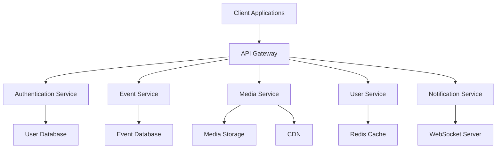
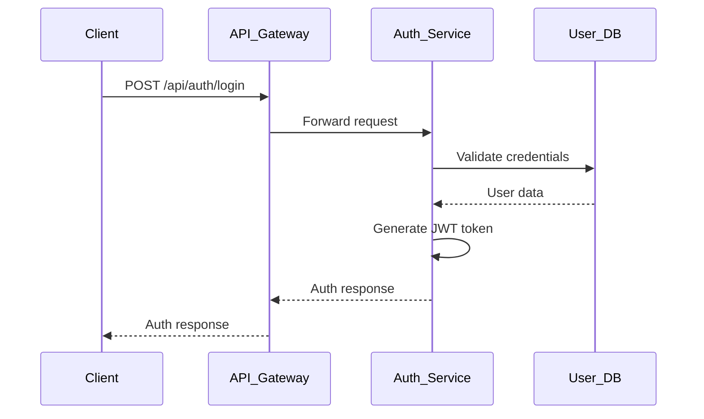
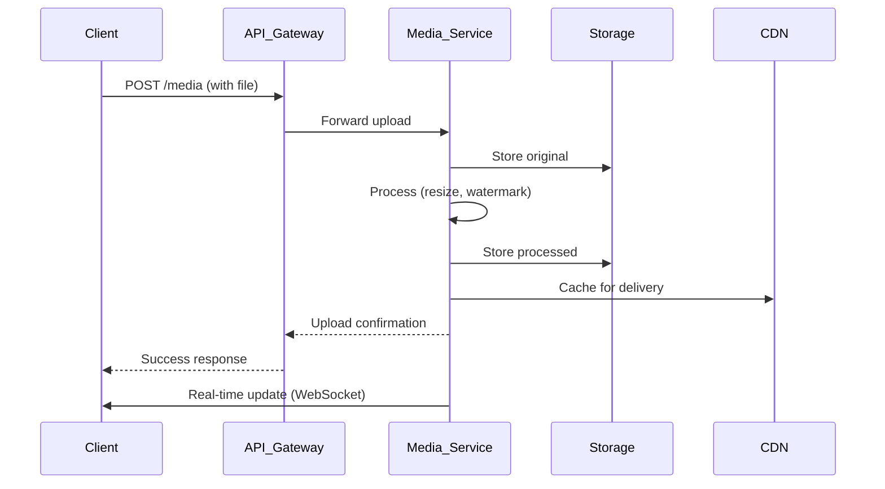
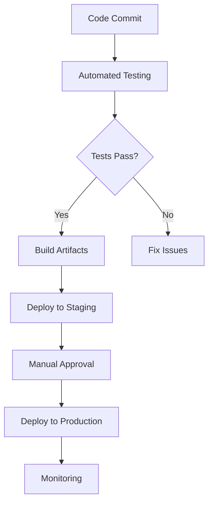

# 🚀 Snapify Developer Guides & Onboarding Documentation

## 📋 Table of Contents

1. [Getting Started Guide](#-1-getting-started-guide)
2. [Development Environment Setup](#-2-development-environment-setup)
3. [Core Concepts and Architecture Overview](#-3-core-concepts-and-architecture-overview)
4. [Development Workflows](#-4-development-workflows)
5. [Testing and Quality Assurance](#-5-testing-and-quality-assurance)
6. [Deployment and CI/CD](#-6-deployment-and-cicd)
7. [Contribution Guidelines](#-7-contribution-guidelines)
8. [Onboarding Checklist and Roadmap](#-8-onboarding-checklist-and-roadmap)

---

## 🎯 1. Getting Started Guide

### 1.1 Welcome to Snapify Development

Welcome to the Snapify development team! This comprehensive guide will help you get started with contributing to our real-time event sharing platform.

### 1.2 Project Overview

**Snapify** is a real-time event sharing platform that enables users to:
- Create and manage events
- Collect photos/videos from guests in real-time
- Share memories without requiring app downloads
- Utilize AI features like captioning and watermarking
- Enjoy live slideshows and interactive guestbooks

### 1.3 Quick Start

```bash
# Clone the repository
git clone https://github.com/your-org/snapify.git
cd snapify

# Install dependencies
npm install

# Start development server
npm run dev
```

### 1.4 Key Resources

- **Official Website**: https://snapify.com
- **Documentation Portal**: https://docs.snapify.com
- **API Reference**: [API_REFERENCE.md](API_REFERENCE.md)
- **Architecture Documentation**: [ARCHITECTURE.md](ARCHITECTURE.md)
- **Deployment Guide**: [DEPLOYMENT.md](DEPLOYMENT.md)

---

## 🛠️ 2. Development Environment Setup

### 2.1 Prerequisites

| Requirement | Version | Purpose |
|------------|---------|---------|
| Node.js | 20+ | JavaScript runtime |
| npm | 10+ | Package manager |
| Git | 2.30+ | Version control |
| Redis | 5.10+ | Caching & real-time messaging |
| SQLite | 5.1+ | Database |
| Docker | Optional | Containerization |

### 2.2 Installation Guide

#### 2.2.1 Node.js and npm

```bash
# Install Node.js 20+ and npm
curl -fsSL https://deb.nodesource.com/setup_20.x | sudo -E bash -
sudo apt-get install -y nodejs

# Verify installation
node -v  # Should show v20.x.x
npm -v   # Should show 10.x.x
```

#### 2.2.2 Redis (Optional but Recommended)

```bash
# Install Redis
sudo apt update
sudo apt install redis-server -y

# Start Redis service
sudo systemctl start redis-server
sudo systemctl enable redis-server

# Test connection
redis-cli ping  # Should return "PONG"
```

#### 2.2.3 Project Setup

```bash
# Clone repository
git clone https://github.com/your-org/snapify.git
cd snapify

# Install dependencies
npm install

# Create environment file
cp .env.example .env

# Edit .env with your local configuration
nano .env
```

### 2.3 Environment Configuration

#### Required Environment Variables

```env
# Development Environment
NODE_ENV=development
PORT=3001

# Database
S3_ENDPOINT=http://localhost:9000
S3_BUCKET_NAME=snapify-dev
S3_ACCESS_KEY=your_access_key
S3_SECRET_KEY=your_secret_key

# Authentication
JWT_SECRET=your_strong_jwt_secret_here
ADMIN_EMAIL=admin@snapify.dev
ADMIN_PASSWORD=secure_admin_password

# AI Services
GEMINI_API_KEY=your_gemini_api_key
OLLAMA_URL=http://localhost:11434

# Redis (optional)
REDIS_HOST=localhost
REDIS_PORT=6379
REDIS_PASSWORD=your_redis_password
```

### 2.4 Development Commands

```bash
# Start development server
npm run dev

# Run production build
npm run build

# Preview production build
npm run preview

# Run tests
npm test

# Run tests with coverage
npm run test:coverage

# Start server only
npm run server
```

---

## 🏗️ 3. Core Concepts and Architecture Overview

### 3.1 System Architecture



### 3.2 Key Components

#### 3.2.1 Frontend Architecture

- **Framework**: React 19.2.0 with TypeScript
- **State Management**: React hooks + Context API + Zustand
- **Styling**: Tailwind CSS 4.1.17
- **Routing**: View-based navigation system
- **PWA**: Progressive Web App with service workers

#### 3.2.2 Backend Architecture

- **Runtime**: Node.js with TypeScript
- **Framework**: Express.js 5.1.0
- **Database**: SQLite 5.1.7 (PostgreSQL migration planned)
- **Caching**: Redis 5.10.0
- **Storage**: AWS S3-compatible (MinIO)
- **Real-time**: Socket.IO 4.8.1 with Redis adapter

### 3.3 Data Flow

#### Authentication Flow



#### Media Upload Flow



### 3.4 Technology Stack

| Category | Technology | Version | Purpose |
|----------|------------|---------|---------|
| **Frontend** | React | 19.2.0 | UI Framework |
| **Frontend** | TypeScript | 5.8.2 | Type Safety |
| **Frontend** | Tailwind CSS | 4.1.17 | Styling |
| **Frontend** | Zustand | 5.0.9 | State Management |
| **Backend** | Node.js | 20+ | Runtime |
| **Backend** | Express.js | 5.1.0 | Web Framework |
| **Backend** | Socket.IO | 4.8.1 | Real-time |
| **Database** | SQLite | 5.1.7 | Data Storage |
| **Cache** | Redis | 5.10.0 | Caching |
| **Storage** | MinIO | - | Media Storage |
| **Testing** | Jest | 30.2.0 | Unit Testing |
| **Testing** | Playwright | 1.44.1 | E2E Testing |
| **Monitoring** | Sentry | 10.27.0 | Error Tracking |
| **Logging** | Winston | 3.18.3 | Logging |

---

## 🔄 4. Development Workflows

### 4.1 Git Workflow


#### Branch Strategy

| Branch | Purpose | Protection |
|--------|---------|------------|
| `main` | Production releases | Protected |
| `develop` | Integration branch | Protected |
| `feature/*` | New features | - |
| `bugfix/*` | Bug fixes | - |
| `hotfix/*` | Critical fixes | - |

#### Commit Message Convention

```
<type>(<scope>): <subject>
<BLANK LINE>
<body>
<BLANK LINE>
<footer>
```

**Types**: `feat`, `fix`, `docs`, `style`, `refactor`, `perf`, `test`, `chore`

### 4.2 Code Review Process

1. **Create Pull Request** from feature branch to `develop`
2. **Assign Reviewers** (2 required for major changes)
3. **Address Feedback** and update code
4. **Merge** after approval
5. **Delete Feature Branch** after merge

### 4.3 Feature Development

```bash
# Create new feature branch
git checkout -b feature/your-feature-name

# Make changes and commit
git add .
git commit -m "feat(api): add new endpoint for user preferences"

# Push to remote
git push origin feature/your-feature-name

# Create pull request
gh pr create --base develop --title "Add user preferences API" --body "Description of changes"
```

### 4.4 Continuous Integration

- **Automated Testing**: Runs on every push
- **Code Quality Checks**: ESLint, Prettier
- **Build Verification**: Ensures project builds successfully
- **Test Coverage**: Minimum 80% required

---

## 🧪 5. Testing and Quality Assurance

### 5.1 Testing Strategy

| Test Type | Framework | Coverage Target |
|-----------|-----------|-----------------|
| Unit Tests | Jest | 80% |
| Integration Tests | Jest | 70% |
| E2E Tests | Playwright | 60% |
| Performance Tests | Jest | 50% |

### 5.2 Running Tests

```bash
# Run all tests
npm test

# Run unit tests
npm run test:unit

# Run integration tests
npm run test:integration

# Run E2E tests
npm run test:e2e

# Run performance tests
npm run test:performance

# Run tests with coverage
npm run test:coverage
```

### 5.3 Test Coverage Requirements

- **Minimum Coverage**: 80% overall
- **Critical Paths**: 100% coverage
- **New Features**: Must include tests
- **Bug Fixes**: Must include regression tests

### 5.4 Code Quality Standards

```bash
# Run linting
npx eslint .

# Run formatting
npx prettier --check .

# Auto-fix formatting
npx prettier --write .
```

#### Code Style Guidelines

- **Indentation**: 2 spaces
- **Line Length**: 100 characters max
- **Naming**: camelCase for variables, PascalCase for components
- **Imports**: Grouped and sorted
- **Comments**: JSDoc for public APIs

---

## 🚀 6. Deployment and CI/CD

### 6.1 Deployment Process



### 6.2 Deployment Commands

```bash
# Build for production
npm run build

# Deploy to production
./deploy.sh

# Check deployment status
pm2 status
sudo systemctl status nginx
```

### 6.3 CI/CD Pipeline

1. **Code Commit** triggers pipeline
2. **Automated Testing** (unit, integration, E2E)
3. **Build Process** creates production artifacts
4. **Staging Deployment** for manual testing
5. **Production Deployment** after approval
6. **Post-Deployment Verification**

### 6.4 Rollback Procedures

```bash
# Rollback to previous version
pm2 stop snapify
cp /var/www/backups/snapify_backup_20231201.tar.gz .
tar -xzf snapify_backup_20231201.tar.gz
pm2 start snapify
```

---

## 🤝 7. Contribution Guidelines

### 7.1 Getting Started as a Contributor

1. **Fork the Repository**
2. **Clone Your Fork**
3. **Set Up Development Environment**
4. **Create Feature Branch**
5. **Make Changes**
6. **Submit Pull Request**

### 7.2 Pull Request Requirements

- **Clear Title**: Descriptive of changes
- **Detailed Description**: What, why, and how
- **Test Coverage**: New tests for new features
- **Documentation**: Update relevant docs
- **Code Review**: Address all feedback

### 7.3 Code of Conduct

- **Be Respectful**: Treat others with courtesy
- **Be Collaborative**: Work together effectively
- **Be Professional**: Maintain high standards
- **Be Open**: Welcome feedback and ideas

### 7.4 Issue Reporting

```markdown
## Issue Title

**Description**: Clear description of the issue

**Steps to Reproduce**:
1. Go to...
2. Click on...
3. Observe...

**Expected Behavior**: What should happen

**Actual Behavior**: What actually happens

**Environment**:
- OS:
- Browser:
- Version:
- Node.js:
```

---

## 📋 8. Onboarding Checklist and Roadmap

### 8.1 New Developer Onboarding Checklist

- [ ] ✅ **Environment Setup**
  - [ ] Install Node.js 20+
  - [ ] Install Redis (optional)
  - [ ] Clone repository
  - [ ] Install dependencies
  - [ ] Configure environment variables

- [ ] ✅ **Project Familiarization**
  - [ ] Read README.md
  - [ ] Review API_REFERENCE.md
  - [ ] Study ARCHITECTURE.md
  - [ ] Understand DEPLOYMENT.md
  - [ ] Explore codebase structure

- [ ] ✅ **Development Setup**
  - [ ] Start development server
  - [ ] Test basic functionality
  - [ ] Run test suite
  - [ ] Verify build process

- [ ] ✅ **First Contribution**
  - [ ] Create feature branch
  - [ ] Make small improvement
  - [ ] Write tests
  - [ ] Submit pull request
  - [ ] Address feedback

### 8.2 Learning Roadmap

#### Week 1: Foundation
- [ ] Project architecture overview
- [ ] Development environment setup
- [ ] Basic development workflow
- [ ] First code contribution

#### Week 2: Core Systems
- [ ] Authentication system
- [ ] Event management
- [ ] Media processing
- [ ] Real-time features

#### Week 3: Advanced Topics
- [ ] Performance optimization
- [ ] Testing strategies
- [ ] Deployment processes
- [ ] Monitoring and logging

#### Week 4: Full Integration
- [ ] End-to-end feature development
- [ ] Production deployment
- [ ] Monitoring and troubleshooting
- [ ] Team collaboration

### 8.3 Mentorship Program

- **Buddy System**: Pair with experienced developer
- **Code Reviews**: Regular feedback sessions
- **Pair Programming**: Collaborative development
- **Knowledge Sharing**: Weekly tech talks

---

## 🎓 Additional Resources

### Learning Materials

- **React Documentation**: https://react.dev/learn
- **TypeScript Handbook**: https://www.typescriptlang.org/docs/handbook
- **Express.js Guide**: https://expressjs.com/en/guide
- **Socket.IO Documentation**: https://socket.io/docs/v4

### Community Resources

- **Slack Channel**: #snapify-dev
- **Weekly Sync**: Fridays at 10:00 AM UTC
- **Tech Talks**: Bi-weekly knowledge sharing
- **Hackathons**: Quarterly innovation events

### Support Channels

- **GitHub Issues**: https://github.com/your-org/snapify/issues
- **Developer Support**: dev-support@snapify.com
- **Emergency Contact**: +1 (555) 123-4567

---

## 🎯 Conclusion

This comprehensive developer guide provides everything you need to get started with Snapify development. From setting up your environment to understanding our architecture, testing practices, and deployment processes, you now have the foundation to contribute effectively.

**Next Steps:**
1. Complete the onboarding checklist
2. Start with a small feature or bug fix
3. Engage with the team and ask questions
4. Contribute to our growing platform!

Welcome to the Snapify development team! 🎉