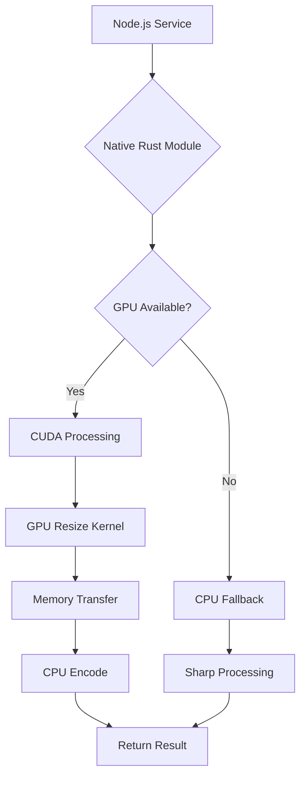

# GPU-Accelerated Image Processing Roadmap

## Current Implementation Analysis

The existing system uses WebAssembly-compiled Rust code for basic image processing operations (resize, format conversion) with Sharp as fallback. This CPU-based approach is slower than Sharp for complex operations.

**Key Findings:**
- WASM compilation prevents GPU access
- Basic operations: resize (Lanczos3/CatmullRom), JPEG/PNG/WebP encoding
- Node.js integration via direct WASM instantiation
- Fallback to Sharp for watermarking and failures

## GPU Acceleration Strategy

### Recommended Approach: CUDA + Native Rust + Neon

**Why CUDA?**
- RTX 3090: 10,496 CUDA cores, 24GB VRAM
- Native NVIDIA optimization
- Best performance potential (10-50x improvement target)
- Direct hardware access

**Architecture Overview:**
```
Node.js Service
    ↓ (Neon FFI)
Native Rust Module (napi-rs/neon)
    ↓ (CUDA Runtime)
CUDA Kernels (cudarc)
    ↓
RTX 3090 GPU
```

### Alternative Options Evaluated

1. **WebGPU (wgpu)**: Cross-platform but ~30-50% slower than CUDA on NVIDIA hardware
2. **OpenCL**: Portable but complex bindings, suboptimal performance
3. **Existing Libraries**:
   - ArrayFire: Good Rust bindings, but general-purpose (not image-optimized)
   - NVIDIA NPP: C/C++ only, requires FFI bindings

## Technical Implementation Plan

### Phase 1: Core Infrastructure (Week 1-2)
- Convert WASM Rust to native library using `napi-rs`
- Set up CUDA development environment
- Implement basic GPU memory management
- Create GPU availability detection

### Phase 2: GPU Resize Implementation (Week 3-4)
- Implement bilinear/lanczos resize kernels
- Optimize for RTX 3090 architecture
- Memory transfer optimizations (pinned memory, streams)
- Benchmark against CPU implementation

### Phase 3: Advanced Operations (Week 5-6)
- GPU-accelerated format conversion where possible
- Hybrid CPU/GPU pipelines (GPU resize + CPU encode)
- Quality optimization and artifact reduction

### Phase 4: Integration & Fallback (Week 7-8)
- Update Node.js service to use native module
- Implement automatic GPU/CPU switching
- Error handling and recovery mechanisms
- Performance monitoring integration

### Phase 5: Optimization & Scaling (Week 9-10)
- Kernel fusion for multi-operation pipelines
- Memory pool management
- Concurrent processing optimization
- Production deployment and monitoring

## Performance Targets

**Phase 2 Milestones:**
- 5-10x improvement on 4K resize operations
- <50ms latency for HD images
- 90% GPU utilization efficiency

**Phase 5 Targets:**
- 10-50x overall improvement vs current CPU implementation
- Sub-20ms latency for standard operations
- >95% GPU utilization
- Maintain Sharp-level quality

## Fallback Strategy

**Multi-Level Fallback:**
1. **Primary**: GPU processing (target)
2. **Secondary**: CPU Rust (current WASM)
3. **Tertiary**: Sharp (reliable baseline)

**Detection Logic:**
- GPU availability check on startup
- Runtime health monitoring
- Automatic failover on errors
- Configurable fallback preferences

## Dependencies & Requirements

**Rust Dependencies:**
- `napi-rs` or `neon` for Node.js binding
- `cudarc` for CUDA bindings
- `image` crate for CPU operations
- `tokio` for async processing

**System Requirements:**
- CUDA 11.8+ toolkit
- RTX 3090 with 24GB VRAM
- Node.js 18+ with native module support

**Development Setup:**
- NVIDIA drivers and CUDA runtime
- Rust nightly for advanced features
- GPU debugging tools (Nsight Compute)

## Risk Mitigation

**Technical Risks:**
- CUDA kernel development complexity
- Memory transfer bottlenecks
- GPU memory limitations for large images

**Mitigation:**
- Start with simple kernels, iterate
- Implement memory streaming for large images
- Comprehensive error handling and logging

**Performance Risks:**
- GPU overhead for small images
- Context switching costs

**Mitigation:**
- Adaptive processing (CPU for small, GPU for large)
- Kernel warm-up and caching
- Continuous benchmarking

## Success Metrics

- **Performance**: 10-50x speedup on target operations
- **Reliability**: <1% failure rate with automatic fallback
- **Quality**: Maintain visual quality parity with Sharp
- **Resource**: <80% GPU utilization under normal load
- **Integration**: Seamless drop-in replacement for current service

## Mermaid Architecture Diagram



This roadmap provides a structured approach to leveraging the RTX 3090's capabilities while maintaining system reliability through comprehensive fallback mechanisms.