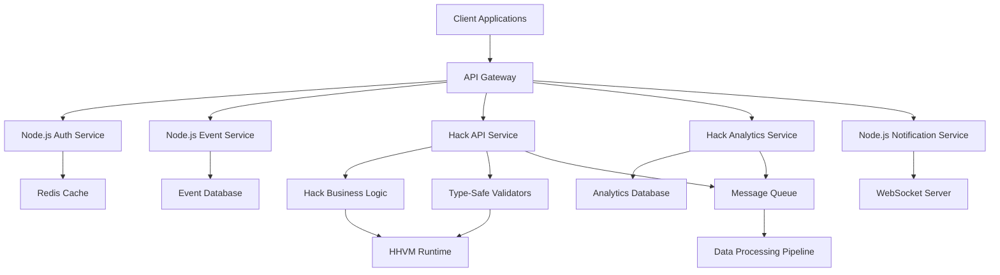
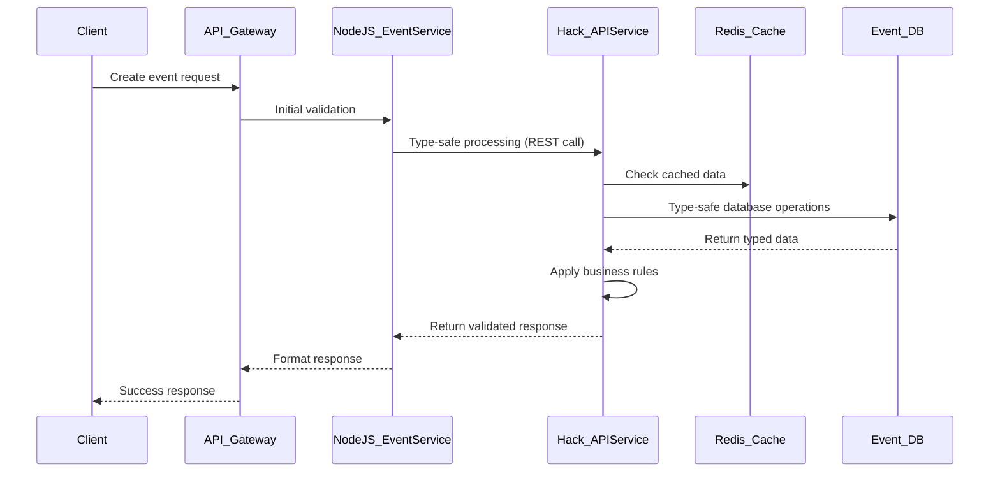
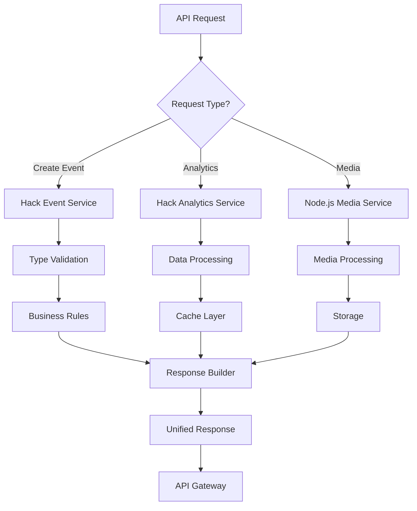

# Hack Integration Strategy for Snapify Web Application

## Executive Summary

This document outlines a comprehensive strategy for integrating Hack into the Snapify web application, leveraging Hack's strengths in statically typed web services, API development, and enterprise features while maintaining compatibility with the existing Node.js/TypeScript stack. Hack provides robust type safety, performance optimizations, and scalable architecture patterns that complement Snapify's real-time event sharing functionality.

## Current Architecture Context

Snapify employs a microservices architecture with Node.js/TypeScript backend, SQLite databases, Redis caching, and real-time WebSocket communication. The system handles event management, media processing, user authentication, and notifications. Existing integrations include Rust for image processing and planned Java/C++ services for enterprise features. Hack integration will focus on type-safe API services and enterprise-grade backend components.

## Use Cases for Hack Integration

### 1. Backend APIs and Type-Safe Services
- **Event Management APIs**: Strongly typed REST endpoints for event CRUD operations with compile-time validation
- **User Authentication Services**: Secure, type-safe authentication and authorization APIs
- **Media Metadata Services**: Type-safe handling of media metadata and processing pipelines
- **Real-time Event Streaming**: Type-safe WebSocket event broadcasting with guaranteed data integrity

### 2. Enterprise Features and Business Logic
- **Advanced Event Analytics**: Type-safe data processing and analytics pipelines
- **User Management System**: Enterprise-grade user profiles with role-based access control
- **Audit and Compliance**: Type-safe logging and audit trail management
- **Business Rules Engine**: Strongly typed business logic execution

### 3. API Gateway and Service Orchestration
- **API Composition**: Type-safe aggregation of multiple service responses
- **Request Routing**: Intelligent routing with type validation
- **Rate Limiting**: Type-safe rate limiting and throttling mechanisms
- **Service Discovery**: Type-safe service registration and discovery

### 4. Data Processing and Validation
- **Input Validation**: Compile-time validation of API inputs and data structures
- **Data Transformation**: Type-safe ETL operations and data mapping
- **Schema Evolution**: Safe database schema changes with type guarantees
- **Caching Strategies**: Type-safe cache management and invalidation

## Performance Advantages

### Type System Benefits
- **Compile-Time Safety**: Catch type errors at compile time, preventing runtime failures
- **Optimized Bytecode**: HHVM compilation provides near-native performance
- **Memory Efficiency**: Advanced memory management with type-aware optimizations
- **Reduced Debugging**: Type errors caught early in development cycle

### Enterprise-Grade Features
- **Scalability**: Built-in support for horizontal scaling with type safety
- **Concurrency**: Async/await patterns with type-safe concurrent operations
- **Resource Management**: Type-safe resource allocation and cleanup
- **Performance Monitoring**: Built-in profiling and performance metrics

### Development Productivity
- **Rapid Development**: Type inference and auto-completion reduce boilerplate
- **Refactoring Safety**: Large-scale refactoring with confidence
- **API Documentation**: Types serve as living documentation
- **Team Collaboration**: Shared understanding through explicit types

## Integration Methods

### 1. Side-by-Side Microservices
Deploy Hack services alongside existing Node.js services with communication via:
- REST APIs for synchronous operations with type-safe contracts
- Message queues (Redis pub/sub) for asynchronous processing
- Shared databases with proper type-safe data synchronization
- gRPC for high-performance, type-safe inter-service communication

### 2. Hybrid Architecture Approach
- **Node.js Layer**: Real-time features, lightweight APIs, and client communication
- **Hack Layer**: Type-safe business logic, enterprise APIs, and data processing
- **API Gateway**: Unified entry point routing requests to appropriate services
- **Event-Driven**: Message queues for decoupling services with type guarantees

### 3. Gradual Migration Strategy
- **Pilot Services**: Start with non-critical services like analytics or user management
- **Incremental Rollout**: Migrate one service at a time with feature flags
- **Parallel Operation**: Run both implementations during transition period
- **Type-Safe Contracts**: Define clear interfaces between services

### 4. Containerized Deployment
- **Docker Integration**: Containerize Hack services for consistent deployment
- **HHVM Runtime**: Optimized container images with HHVM
- **Orchestration**: Kubernetes integration for service management
- **CI/CD Integration**: Automated testing and deployment pipelines

## Trade-offs and Considerations

### Advantages
- Superior type safety preventing runtime errors
- Excellent performance for web services
- Mature enterprise features and patterns
- Seamless integration with existing Node.js stack

### Challenges
- **Learning Curve**: Team training for Hack/HHVM development
- **Ecosystem Maturity**: Smaller community compared to mainstream languages
- **Deployment Complexity**: Additional runtime (HHVM) management
- **Resource Requirements**: Higher memory usage for type checking

### Mitigation Strategies
- **Start Small**: Begin with pilot projects to validate approach
- **Shared Infrastructure**: Leverage existing monitoring and logging tools
- **Standardization**: Establish common patterns for cross-service communication
- **Gradual Adoption**: Incremental integration to minimize risk

## Code Examples

### Hack API Service for Event Management

```hack
<?hh // strict

final class EventController {
  public function __construct(
    private EventRepository $eventRepo,
    private UserValidator $userValidator,
  ) {}

  public function createEvent(CreateEventRequest $request): EventResponse {
    $user = $this->userValidator->validateAuthenticatedUser($request->getUserId());

    $event = new Event(
      $request->getTitle(),
      $request->getDescription(),
      $request->getStartTime(),
      $user->getId(),
    );

    $savedEvent = $this->eventRepo->save($event);

    return new EventResponse($savedEvent);
  }

  public function getEvent(GetEventRequest $request): EventResponse {
    $event = $this->eventRepo->findById($request->getEventId())
      ?? throw new EventNotFoundException($request->getEventId());

    return new EventResponse($event);
  }
}

final class CreateEventRequest {
  public function __construct(
    private string $title,
    private string $description,
    private int $startTime,
    private string $userId,
  ) {}

  public function getTitle(): string { return $this->title; }
  public function getDescription(): string { return $this->description; }
  public function getStartTime(): int { return $this->startTime; }
  public function getUserId(): string { return $this->userId; }
}

final class EventResponse {
  public function __construct(private Event $event) {}
  public function getEvent(): Event { return $this->event; }
}
```

### Type-Safe Analytics Service

```hack
<?hh // strict

final class AnalyticsService {
  public function __construct(
    private AnalyticsRepository $analyticsRepo,
    private Cache<EventAnalytics> $cache,
  ) {}

  public async function getEventAnalytics(
    string $eventId,
    int $startTime,
    int $endTime,
  ): Awaitable<EventAnalytics> {
    $cacheKey = $eventId . ':' . $startTime . ':' . $endTime;

    $cached = $this->cache->get($cacheKey);
    if ($cached !== null) {
      return $cached;
    }

    $rawData = await $this->analyticsRepo->getEventData($eventId, $startTime, $endTime);

    $analytics = new EventAnalytics(
      $this->calculateTotalViews($rawData),
      $this->calculateEngagementRate($rawData),
      $this->findPeakHours($rawData),
    );

    $this->cache->set($cacheKey, $analytics, 3600); // Cache for 1 hour

    return $analytics;
  }

  private function calculateTotalViews(Vector<EventView> $views): int {
    return $views->map($view ==> $view->getCount())->sum();
  }

  private function calculateEngagementRate(Vector<EventView> $views): float {
    $totalViews = $this->calculateTotalViews($views);
    $totalInteractions = $views->map($view ==> $view->getInteractions())->sum();

    return $totalViews > 0 ? (float)$totalInteractions / $totalViews : 0.0;
  }

  private function findPeakHours(Vector<EventView> $views): Vector<int> {
    $hourlyStats = Map {};
    foreach ($views as $view) {
      $hour = (int)($view->getTimestamp() / 3600);
      $hourlyStats[$hour] = ($hourlyStats[$hour] ?? 0) + $view->getCount();
    }

    return $hourlyStats
      ->toVector()
      ->sortByDesc($stat ==> $stat[1])
      ->take(3)
      ->map($stat ==> $stat[0]);
  }
}

final class EventAnalytics {
  public function __construct(
    private int $totalViews,
    private float $engagementRate,
    private Vector<int> $peakHours,
  ) {}

  public function getTotalViews(): int { return $this->totalViews; }
  public function getEngagementRate(): float { return $this->engagementRate; }
  public function getPeakHours(): Vector<int> { return $this->peakHours; }
}
```

### Node.js Integration with Hack Service

```javascript
// Node.js service calling Hack microservice
const axios = require('axios');

class HackEventService {
    constructor() {
        this.hackServiceUrl = process.env.HACK_SERVICE_URL || 'http://localhost:8080';
    }

    async createEvent(eventData) {
        try {
            const response = await axios.post(`${this->hackServiceUrl}/api/events`, {
                title: eventData.title,
                description: eventData.description,
                startTime: eventData.startTime,
                userId: eventData.userId
            }, {
                headers: { 'Content-Type': 'application/json' }
            });

            return response.data;
        } catch (error) {
            console.error('Hack service error:', error.message);
            // Fallback to Node.js processing
            return this.fallbackCreateEvent(eventData);
        }
    }

    async getEventAnalytics(eventId, startTime, endTime) {
        try {
            const response = await axios.get(`${this->hackServiceUrl}/api/analytics/events/${eventId}`, {
                params: { startTime, endTime }
            });

            return response.data;
        } catch (error) {
            console.error('Hack analytics service error:', error.message);
            return { totalViews: 0, engagementRate: 0, peakHours: [] };
        }
    }

    fallbackCreateEvent(eventData) {
        // Basic event creation in Node.js
        return {
            id: generateId(),
            title: eventData.title,
            description: eventData.description,
            startTime: eventData.startTime,
            userId: eventData.userId,
            createdAt: Date.now()
        };
    }
}

module.exports = HackEventService;
```

### Async Operations with Type Safety

```hack
<?hh // strict

final class AsyncMediaProcessor {
  public function __construct(
    private MediaRepository $mediaRepo,
    private ImageProcessor $imageProcessor,
  ) {}

  public async function processMediaBatch(
    Vector<MediaItem> $mediaItems,
  ): Awaitable<Vector<ProcessedMedia>> {
    // Process multiple items concurrently with type safety
    $processingTasks = Vector {};

    foreach ($mediaItems as $item) {
      $processingTasks[] = $this->processSingleMedia($item);
    }

    // Wait for all processing to complete
    $results = await GenVector::fromItems($processingTasks);

    // Filter successful results
    return $results->filter($result ==> $result->isSuccessful());
  }

  private async function processSingleMedia(MediaItem $item): Awaitable<ProcessedMedia> {
    try {
      // Type-safe image processing
      $processedImage = await $this->imageProcessor->process($item->getImageData());

      // Save with type guarantees
      $savedMedia = await $this->mediaRepo->saveProcessedMedia(
        $item->getId(),
        $processedImage
      );

      return new ProcessedMedia($savedMedia, true);

    } catch (Exception $e) {
      // Type-safe error handling
      return new ProcessedMedia(null, false, $e->getMessage());
    }
  }
}

final class ProcessedMedia {
  public function __construct(
    private ?SavedMedia $media,
    private bool $successful,
    private string $errorMessage = '',
  ) {}

  public function isSuccessful(): bool { return $this->successful; }
  public function getMedia(): ?SavedMedia { return $this->media; }
  public function getErrorMessage(): string { return $this->errorMessage; }
}
```

## Architectural Diagrams

### Integrated Microservices Architecture with Hack



### Data Flow with Hack Type-Safe Integration



### Type-Safe Service Orchestration



## Implementation Roadmap

### Phase 1: Foundation (1-2 months)
- Set up Hack/HHVM development environment and virtual environments
- Create pilot type-safe API service for basic event operations
- Establish communication patterns with existing Node.js services
- Implement basic type-safe data validation and error handling

### Phase 2: Core Integration (2-4 months)
- Deploy comprehensive event management service with full type safety
- Implement analytics service with type-safe data processing
- Add type-safe caching and session management
- Integrate message queue processing for async operations

### Phase 3: Advanced Features (1-2 months)
- Implement advanced business logic with type-safe rules engine
- Add comprehensive API documentation generation from types
- Develop type-safe testing frameworks and utilities
- Optimize performance with HHVM-specific tuning

### Phase 4: Production Optimization (1-2 months)
- Performance tuning and resource optimization
- Security hardening and access controls
- Comprehensive testing and validation
- Documentation and team training

## Conclusion

Integrating Hack into Snapify provides transformative type safety and performance advantages for backend APIs and enterprise services while maintaining the real-time performance of the existing Node.js architecture. Hack's statically typed nature ensures compile-time validation of business logic, API contracts, and data processing pipelines, significantly reducing runtime errors and improving development velocity.

The microservices approach allows gradual adoption with minimal risk, enabling the platform to leverage Hack's strengths where type safety and performance are most critical. Key success factors include starting with pilot API services, establishing clear type-safe contracts between services, and maintaining comprehensive monitoring across the polyglot architecture.

This strategy positions Snapify for scalable enterprise growth with enhanced reliability and maintainability, while preserving its core event sharing functionality through careful integration with the existing Node.js/TypeScript stack.