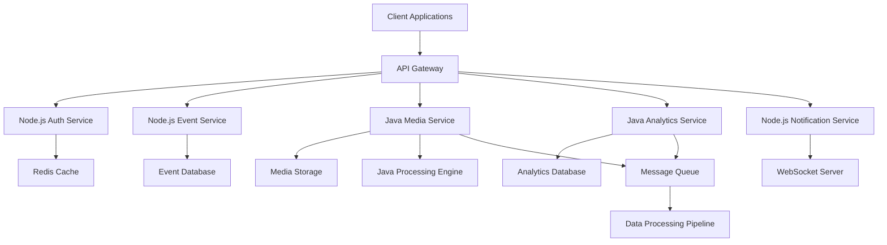
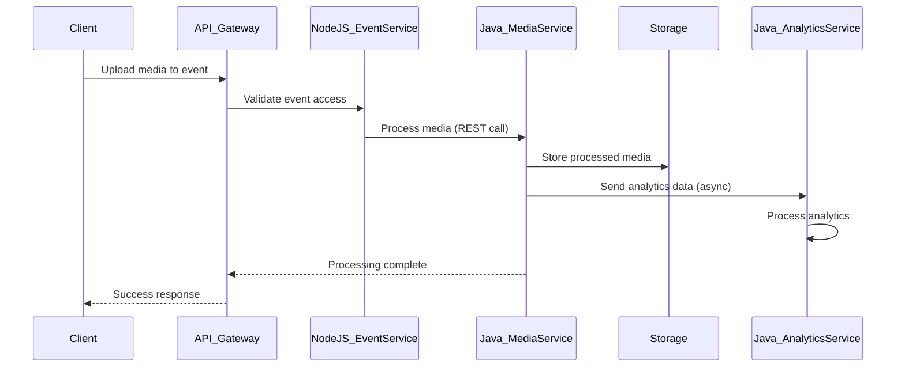

# Java Integration Strategy for SnapifY Web Application

## Executive Summary

This document outlines a practical strategy for integrating Java into the SnapifY web application, leveraging Java's strengths in enterprise-grade backend services, microservices architecture, and data processing while maintaining compatibility with the existing Node.js/TypeScript stack.

## Current Architecture Context

SnapifY employs a microservices architecture with Node.js/TypeScript backend, SQLite databases, Redis caching, and real-time WebSocket communication. The system handles event management, media processing, user authentication, and notifications.

## Use Cases for Java Integration

### 1. Backend Services
- **Advanced Media Processing**: CPU-intensive image manipulation, video transcoding, and AI/ML inference pipelines
- **Business Logic Engines**: Complex event analytics, user behavior analysis, and recommendation systems
- **Enterprise Integrations**: LDAP authentication, SAML SSO, and ERP system connections

### 2. Enterprise Tooling
- **Reporting Services**: Scheduled report generation and dashboard analytics
- **Audit and Compliance**: Centralized logging, audit trails, and regulatory compliance tracking
- **Workflow Automation**: Business process management and automated task scheduling

### 3. APIs and Microservices
- **High-Throughput APIs**: RESTful services handling heavy traffic with Spring Boot
- **Service Orchestration**: Coordinating complex workflows across multiple services
- **API Gateway Extensions**: Advanced routing, transformation, and security features

### 4. Microservices Architecture
- **User Management Service**: Enhanced user profiles, role management, and permissions
- **Event Processing Service**: Complex event logic, scheduling, and lifecycle management
- **Notification Hub**: Multi-channel notification delivery with templating and personalization

### 5. Data Processing Pipelines
- **Batch Processing**: ETL operations, data migration, and bulk analytics with Spring Batch
- **Stream Processing**: Real-time data pipelines using Kafka and Spring Cloud Stream
- **Data Warehousing**: Aggregation, transformation, and reporting data flows

## Performance Advantages

### JVM Ecosystem Benefits
- **JIT Compilation**: Optimized performance for long-running applications
- **Advanced Memory Management**: Sophisticated garbage collection algorithms
- **Threading Model**: Superior concurrency handling compared to Node.js single-threaded model

### Enterprise-Grade Features
- **Mature Libraries**: Apache Commons, Hibernate ORM, Spring Framework ecosystem
- **Built-in Monitoring**: JMX, Micrometer for comprehensive observability
- **Security Frameworks**: Spring Security with enterprise authentication protocols

### Scalability Enhancements
- **Horizontal Scaling**: Clustering and load balancing capabilities
- **Resource Management**: Fine-grained control over CPU and memory allocation
- **Fault Tolerance**: Circuit breakers, retries, and graceful degradation patterns

## Integration Methods

### 1. Side-by-Side Microservices
Deploy Java services alongside existing Node.js services with communication via:
- REST APIs for synchronous operations
- Message queues (Redis pub/sub or Kafka) for asynchronous processing
- Shared databases with proper transaction management

### 2. Hybrid Architecture Approach
- **Node.js Layer**: Real-time features, lightweight APIs, and client communication
- **Java Layer**: Heavy computation, enterprise integrations, and data processing
- **API Gateway**: Unified entry point routing requests to appropriate services

### 3. Gradual Migration Strategy
- **Pilot Services**: Start with non-critical services like analytics or reporting
- **Incremental Rollout**: Migrate one service at a time with feature flags
- **Parallel Operation**: Run both implementations during transition period

### 4. Containerized Deployment
- **Docker Integration**: Containerize Java services for consistent deployment
- **Orchestration**: Use Kubernetes for service discovery and scaling
- **CI/CD Integration**: Automated testing and deployment pipelines

## Trade-offs and Considerations

### Advantages
- Enhanced performance for CPU-intensive workloads
- Rich enterprise ecosystem and tooling
- Improved scalability and fault tolerance
- Better support for complex business logic

### Challenges
- **Increased Complexity**: Polyglot architecture requiring multiple language expertise
- **Resource Overhead**: Higher memory and startup time compared to Node.js
- **Learning Curve**: Team training and onboarding for Java development
- **Operational Overhead**: Managing multiple runtimes and deployment processes

### Mitigation Strategies
- **Start Small**: Begin with pilot projects to validate approach
- **Shared Infrastructure**: Leverage existing monitoring and logging tools
- **Standardization**: Establish common patterns for cross-service communication
- **Gradual Adoption**: Incremental integration to minimize risk

## Code Examples

### Spring Boot Microservice for Media Processing

```java
@SpringBootApplication
public class MediaProcessingServiceApplication {
    public static void main(String[] args) {
        SpringApplication.run(MediaProcessingServiceApplication.class, args);
    }
}

@RestController
@RequestMapping("/api/media")
public class MediaController {

    @Autowired
    private MediaProcessingService mediaService;

    @PostMapping("/process")
    public ResponseEntity<MediaProcessResponse> processMedia(@RequestBody MediaProcessRequest request) {
        try {
            MediaProcessResponse response = mediaService.process(request);
            return ResponseEntity.ok(response);
        } catch (Exception e) {
            return ResponseEntity.status(HttpStatus.INTERNAL_SERVER_ERROR).build();
        }
    }
}

@Service
public class MediaProcessingService {

    @Autowired
    private RestTemplate restTemplate;

    public MediaProcessResponse process(MediaProcessRequest request) {
        // Advanced image processing logic
        // Integration with existing Node.js services via REST calls

        // Example: Call Node.js media service for initial processing
        String nodeJsResponse = restTemplate.postForObject(
            "http://nodejs-media-service/api/media/initial-process",
            request,
            String.class
        );

        // Perform Java-specific heavy processing
        // Return enhanced result
        return new MediaProcessResponse();
    }
}
```

### Integration with Node.js Service

```javascript
// Node.js service calling Java microservice
const axios = require('axios');

async function processMediaWithJava(request) {
    try {
        const javaResponse = await axios.post(
            'http://java-media-service/api/media/process',
            request
        );

        // Process Java response and continue with Node.js logic
        return javaResponse.data;
    } catch (error) {
        // Fallback to existing Node.js processing
        return fallbackProcessing(request);
    }
}
```

## Architectural Diagrams

### Integrated Microservices Architecture



### Data Flow with Java Integration



## Implementation Roadmap

### Phase 1: Foundation (1-2 months)
- Set up Java development environment and CI/CD pipelines
- Create pilot Java microservice for analytics
- Establish communication patterns with existing services

### Phase 2: Core Integration (2-4 months)
- Migrate media processing to Java service
- Implement enterprise authentication integrations
- Add data processing pipelines

### Phase 3: Optimization (1-2 months)
- Performance tuning and monitoring
- Security hardening
- Documentation and training

### Phase 4: Expansion (Ongoing)
- Additional microservices as needed
- Advanced features leveraging Java ecosystem
- Continuous improvement and maintenance

## Conclusion

Integrating Java into SnapifY provides significant benefits for enterprise-grade features, performance-critical operations, and complex data processing while maintaining the agility of the existing Node.js architecture. The side-by-side microservices approach allows gradual adoption with minimal risk, enabling the platform to leverage Java's strengths where most beneficial.

Key success factors include starting with pilot projects, establishing clear communication patterns, and maintaining comprehensive monitoring across the polyglot architecture. This strategy positions SnapifY for scalable enterprise growth while preserving its real-time event sharing capabilities.