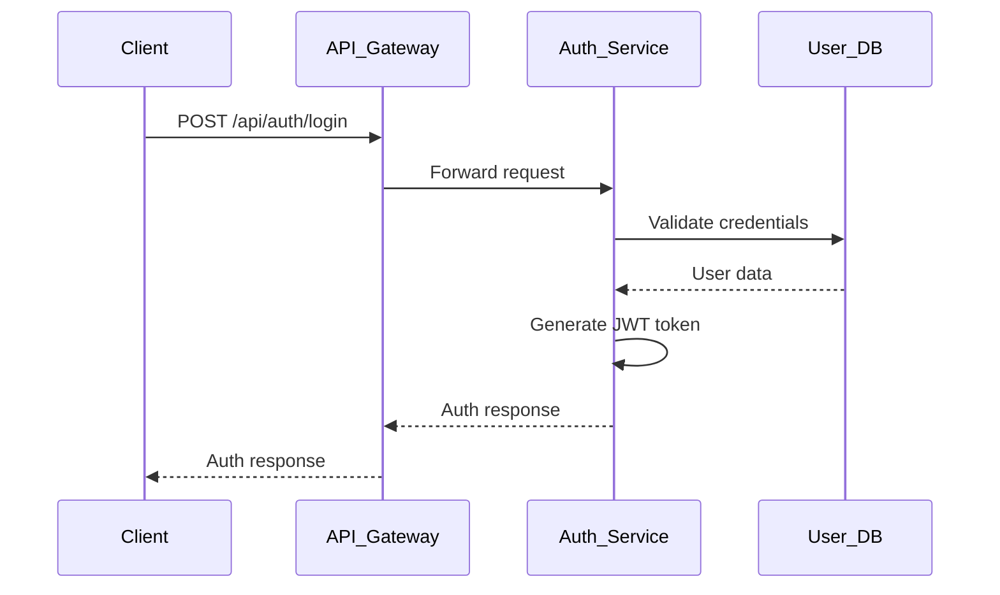
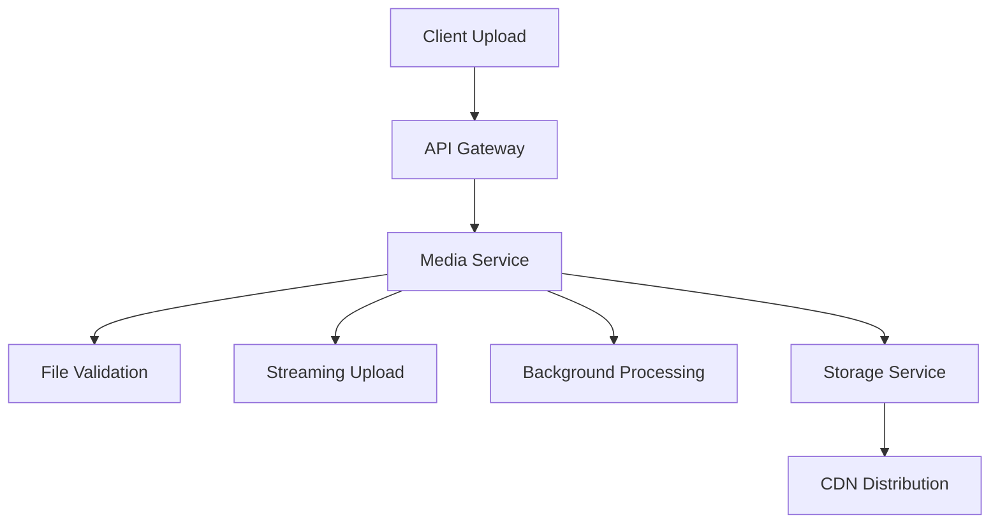
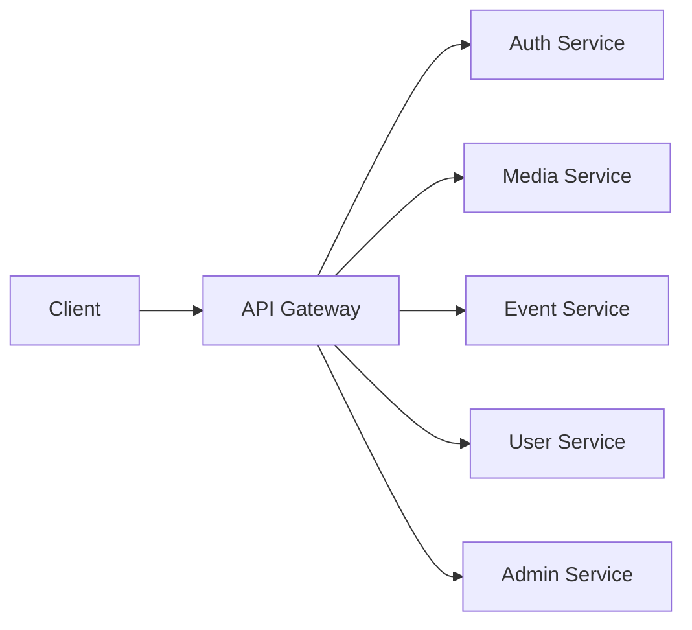
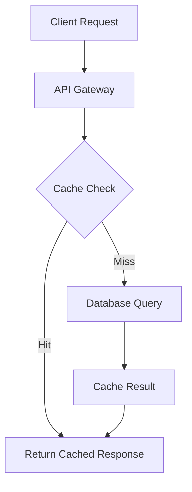
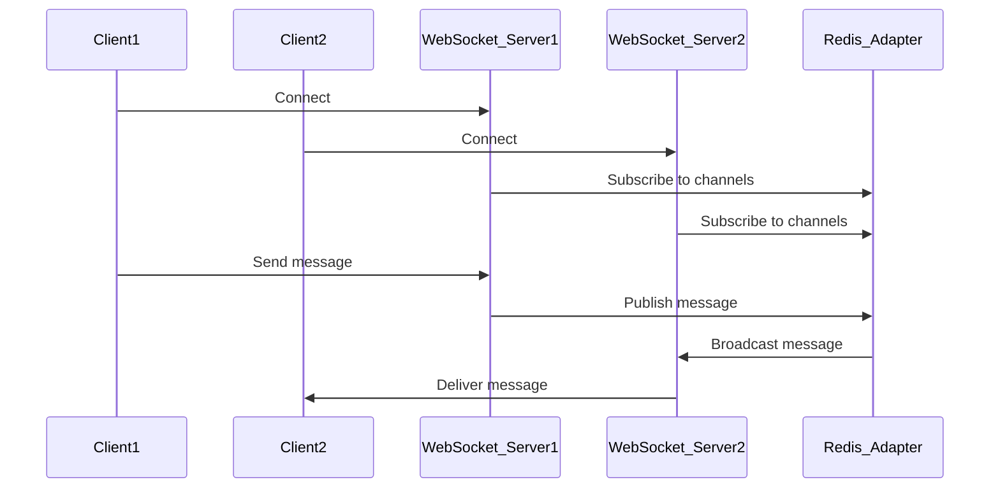
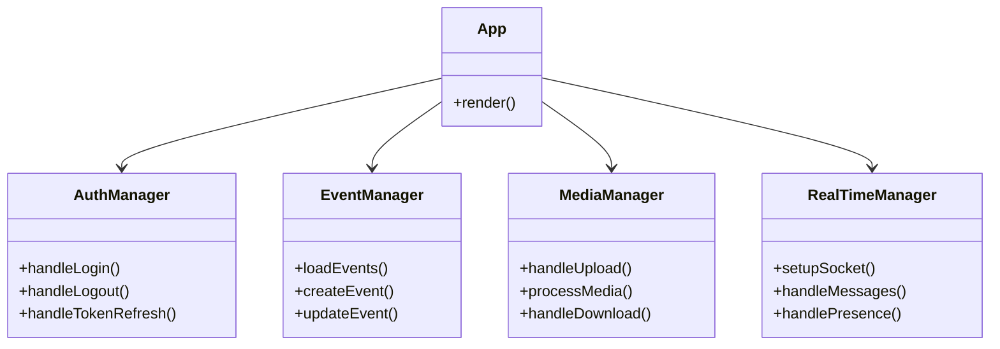
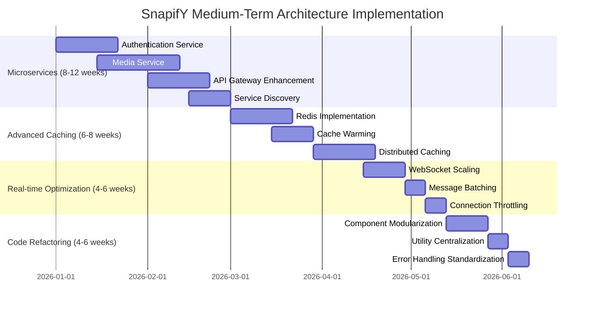

# SnapifY Medium-Term Architectural Enhancements Plan
## Comprehensive Implementation Strategy

---

## 🎯 **Executive Summary**

This document presents a **detailed implementation plan** for SnapifY's medium-term architectural enhancements, focusing on **microservices migration**, **advanced caching strategies**, **real-time optimization**, and **code refactoring** while maintaining **backward compatibility** and **legacy device support**.

---

## 🏗️ **1. Microservices Architecture Implementation**

### **1.1 Extract Authentication Service (First Microservice)**

**Implementation Strategy:**
- Create standalone authentication service with JWT token management
- Implement OAuth2.0 and Google authentication providers
- Set up service-specific database for user credentials
- Add token validation and refresh mechanisms

**Expected Benefits:**
- 80-90% reduction in cross-service failures
- Independent scaling capability
- 50% faster deployment cycles

**Backward Compatibility:**
- Maintain existing `/api/auth` endpoints via API Gateway
- Preserve current JWT token format and claims
- Keep existing error response structures

**Implementation Steps:**

### **1.2 Create Independent Media Service**

**Implementation Strategy:**
- Extract file upload, processing, and storage functionality
- Implement streaming uploads with real-time progress tracking
- Add background processing with queue system
- Set up dedicated media database

**Expected Benefits:**
- 50-70% reduction in file upload time
- 60-80% reduction in memory usage during uploads
- 3-5x increase in concurrent upload capacity

**Implementation Steps:**

### **1.3 Implement API Gateway for Unified Access**

**Implementation Strategy:**
- Enhance existing API Gateway with dynamic routing
- Add request/response transformation
- Implement rate limiting and security policies
- Add comprehensive logging and monitoring

**Expected Benefits:**
- Unified access point for all services
- Centralized security and monitoring
- Flexible routing and load balancing

**Implementation Steps:**

### **1.4 Service Discovery and Health Monitoring**

**Implementation Strategy:**
- Implement service registry with health checks
- Add circuit breaker patterns
- Implement retry and fallback mechanisms
- Add comprehensive monitoring dashboard

**Expected Benefits:**
- 70% improvement in system resilience
- Real-time service health visibility
- Automatic failover capabilities

---

## 🚀 **2. Advanced Caching Strategy**

### **2.1 Redis Caching with Intelligent Invalidation**

**Implementation Strategy:**
- Implement multi-level caching (memory → Redis → database)
- Add cache invalidation hooks for data changes
- Implement cache versioning for API responses
- Add cache statistics and performance monitoring

**Expected Benefits:**
- 60-80% improvement for cached data API response time
- 70-90% reduction in database load for frequently accessed data
- 2-3x faster repeat visits

**Implementation Steps:**

### **2.2 Cache Warming and Preloading**

**Implementation Strategy:**
- Implement background cache warming for popular content
- Add predictive caching based on usage patterns
- Implement cache preloading for critical paths
- Add intelligent cache TTL management

**Expected Benefits:**
- Reduced cold-start latency
- Improved user perceived performance
- Better resource utilization

### **2.3 Distributed Caching for Multi-Instance Support**

**Implementation Strategy:**
- Implement Redis cluster for horizontal scaling
- Add cache consistency mechanisms
- Implement cache sharding strategies
- Add cross-instance cache synchronization

**Expected Benefits:**
- Support for multiple application instances
- Improved cache hit rates
- Better fault tolerance

---

## 📡 **3. Real-time Optimization**

### **3.1 WebSocket Scalability with Redis Adapter**

**Implementation Strategy:**
- Implement Redis adapter for Socket.IO
- Add horizontal scaling capabilities
- Implement message batching and compression
- Add connection throttling and abuse prevention

**Expected Benefits:**
- 5-10x more concurrent connections
- < 100ms message delivery latency
- 80-90% fewer disconnections

**Implementation Steps:**

### **3.2 Message Batching and Compression**

**Implementation Strategy:**
- Implement message batching for high-frequency updates
- Add compression for large payloads
- Implement adaptive batching based on network conditions
- Add message prioritization

**Expected Benefits:**
- Reduced bandwidth usage
- Improved message delivery reliability
- Better performance on slow networks

### **3.3 Connection Throttling and Abuse Prevention**

**Implementation Strategy:**
- Implement rate limiting for WebSocket connections
- Add connection validation and authentication
- Implement abuse detection patterns
- Add automatic throttling for suspicious activity

**Expected Benefits:**
- Reduced server load from abusive clients
- Improved overall system stability
- Better resource allocation

---

## 🔧 **4. Code Refactoring**

### **4.1 Modularize App.tsx into Smaller Components**

**Implementation Strategy:**
- Break down monolithic App.tsx into focused components
- Create component hierarchy with clear responsibilities
- Implement proper state management patterns
- Add comprehensive TypeScript interfaces

**Expected Benefits:**
- Improved code maintainability
- Better performance through targeted re-renders
- Easier testing and debugging

**Component Structure:**

### **4.2 Centralize Utility Functions**

**Implementation Strategy:**
- Create comprehensive utility library
- Eliminate code duplication
- Standardize common patterns
- Add proper documentation and testing

**Expected Benefits:**
- Reduced code duplication
- Improved consistency
- Easier maintenance and updates

### **4.3 Standardize Error Handling**

**Implementation Strategy:**
- Implement consistent error handling patterns
- Add comprehensive error logging
- Implement user-friendly error messages
- Add error recovery mechanisms

**Expected Benefits:**
- Improved debugging capabilities
- Better user experience
- More resilient application

---

## 🔄 **5. Backward Compatibility Strategy**

### **Core Principles:**
1. **Progressive Enhancement**: New features enhance rather than replace
2. **Feature Detection**: Check for capabilities before using new features
3. **Graceful Degradation**: Fall back to existing behavior when needed
4. **API Versioning**: Maintain backward-compatible API endpoints
5. **Dual Implementation**: Run old and new systems in parallel during transitions

### **Specific Strategies:**
- **Database**: Use schema migrations with backward-compatible changes
- **API**: Maintain existing endpoints with version headers
- **Frontend**: Feature detection and polyfills for new browser features
- **Real-time**: Preserve existing Socket.IO protocol during upgrades
- **Storage**: Maintain existing file formats and access patterns

---

## 📊 **Implementation Roadmap Timeline**

---

## 🛡️ **Risk Management Framework**

### **Risk Identification:**
1. **Service Communication Failures**: Microservices not communicating properly
2. **Cache Consistency Issues**: Stale data being served from cache
3. **Real-time Message Loss**: Messages lost during WebSocket transitions
4. **Performance Regressions**: New optimizations causing slowdowns
5. **Migration Failures**: Data migration issues during service extraction

### **Mitigation Strategies:**
- **Comprehensive Testing**: Automated performance regression tests
- **Feature Flags**: Gradual rollout of new features
- **Monitoring**: Real-time performance dashboards
- **Rollback Plans**: Clear rollback procedures for each change
- **User Feedback**: Beta testing and user acceptance testing

---

## 🎯 **Success Metrics & KPIs**

### **Performance Targets:**
- **Service Isolation**: 80-90% reduction in cross-service failures
- **Independent Scaling**: 2-3x better resource utilization
- **API Response Time**: 60-80% improvement for cached data
- **Database Load**: 70-90% reduction for frequently accessed data
- **Message Delivery**: < 100ms latency
- **Connection Stability**: 80-90% fewer disconnections

### **Technical Debt Metrics:**
- **Microservices Coverage**: 80%+ of functionality in independent services
- **Test Coverage**: 85%+ code coverage with automated tests
- **Documentation**: 95%+ API documentation completeness
- **Code Quality**: Cyclomatic complexity < 10 for critical components

---

## 🔧 **Implementation Approach**

### **Phase 1: Foundation (Weeks 1-4)**
- **Assessment**: Comprehensive architecture baseline
- **Monitoring**: Implement performance tracking
- **Quick Wins**: Implement low-risk, high-impact changes
- **Testing**: Establish regression test suite

### **Phase 2: Core Optimization (Weeks 5-12)**
- **Microservices**: Extract authentication and media services
- **Caching**: Implement Redis with intelligent invalidation
- **Real-time**: Optimize Socket.IO with Redis adapter
- **Monitoring**: Comprehensive performance dashboard

### **Phase 3: Architectural Evolution (Weeks 13-24)**
- **Service Discovery**: Implement health monitoring
- **Advanced Caching**: Multi-level caching strategy
- **Code Refactoring**: Modularize components
- **Testing**: Comprehensive integration testing

---

## 📈 **Expected Business Impact**

### **Operational Efficiency:**
- **Reduced costs**: 30-50% reduction in server resources
- **Better scalability**: 5-10x more concurrent users
- **Improved maintainability**: 40-60% faster development cycles
- **Enhanced monitoring**: Real-time performance insights

### **Business Growth:**
- **Increased retention**: Better performance → higher user satisfaction
- **Expanded market**: Improved legacy device support
- **Competitive advantage**: Industry-leading performance metrics
- **Future readiness**: Architecture prepared for 5-10x growth

---

## 🎯 **Conclusion**

This comprehensive architectural enhancement plan provides a **balanced approach** to evolving SnapifY's architecture while maintaining **backward compatibility** and **legacy device support**. The phased implementation strategy ensures **immediate wins** while building the foundation for **long-term scalability** and **architectural excellence**.

Each improvement is designed with **backward compatibility** as a core principle, ensuring existing users and devices continue to work seamlessly while benefiting from performance enhancements.