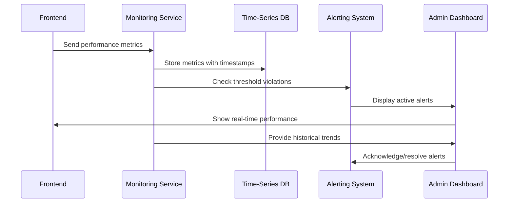

# SnapifY Performance Monitoring System Architecture
## Phase 4: Strategic Scaling Implementation

---

## 🎯 Executive Summary

This document outlines the comprehensive performance monitoring system architecture for SnapifY's Phase 4: Strategic Scaling. The system provides real-time performance metrics collection, service health monitoring, user experience analytics, infrastructure monitoring, and alerting capabilities.

---

## 🏗️ Architecture Overview

### **1. Comprehensive Monitoring Architecture**

```mermaid
graph TD
    A[Performance Monitoring System] --> B[Real-time Metrics Collection]
    A --> C[Service Health Monitoring]
    A --> D[User Experience Analytics]
    A --> E[Infrastructure Monitoring]
    A --> F[Alerting & Notifications]

    B --> B1[Frontend Performance]
    B --> B2[Backend Performance]
    B --> B3[Database Performance]
    B --> B4[Network Performance]

    C --> C1[Service Status]
    C --> C2[Dependency Health]
    C --> C3[Error Rates]
    C --> C4[Response Times]

    D --> D1[Page Load Metrics]
    D --> D2[User Journey Analytics]
    D --> D3[Device Performance]
    D --> D4[Session Quality]

    E --> E1[Server Resources]
    E --> E2[Storage Usage]
    E --> E3[CDN Performance]
    E --> E4[Container Health]

    F --> F1[Threshold Alerts]
    F --> F2[Anomaly Detection]
    F --> F3[Notification Channels]
    F --> F4[Escalation Policies]
```

---

## 📊 Core Components

### **1. Real-time Performance Metrics Collection**

#### **Frontend Metrics**
- Page load times (FCP, LCP, TTFB)
- Render performance (FPS, layout shifts)
- Memory usage and garbage collection
- Network requests and latency
- User interaction responsiveness

#### **Backend Metrics**
- API response times and success rates
- Database query performance
- Service processing times
- Queue processing metrics
- Error rates and patterns

#### **Infrastructure Metrics**
- CPU, memory, disk usage
- Network bandwidth and latency
- Container health and resource usage
- Storage capacity and I/O performance
- CDN cache hit rates

---

### **2. Service Health Monitoring System**

#### **Service Status Tracking**
- Microservice availability and response times
- Dependency health checks
- Circuit breaker status
- Service degradation detection

#### **Performance Indicators**
- Request throughput and latency
- Error rates and patterns
- Resource utilization
- Dependency response times

---

### **3. User Experience Analytics Dashboard**

#### **Core Metrics**
- Page load performance by device type
- User journey completion rates
- Interaction responsiveness
- Session quality scores
- Device-specific performance

#### **Visualization Components**
- Real-time performance charts
- Historical trend analysis
- Device/location breakdowns
- User satisfaction indicators

---

### **4. Infrastructure Monitoring Capabilities**

#### **Resource Monitoring**
- Server CPU, memory, disk usage
- Container resource allocation
- Storage capacity and usage
- Network bandwidth and latency

#### **Service Monitoring**
- Microservice health and status
- Database performance and connections
- Cache hit rates and efficiency
- Queue processing metrics

---

### **5. Alerting and Notification System**

#### **Alert Types**
- Threshold-based alerts (CPU > 90%, error rate > 5%)
- Anomaly detection (sudden performance drops)
- Service degradation alerts
- Resource exhaustion warnings

#### **Notification Channels**
- Admin dashboard notifications
- Email alerts for critical issues
- Slack/Webhook integrations
- SMS for high-priority incidents

#### **Escalation Policies**
- Warning → Critical → Emergency escalation
- Time-based escalation for unresolved issues
- Team-specific routing
- On-call rotation support

---

## 🔧 Implementation Strategy

### **Phase 1: Foundation (Weeks 1-2)**
- **Real-time Metrics Collection**: Implement core metrics gathering
- **Service Health Monitoring**: Basic service status tracking
- **Dashboard Integration**: Connect to existing PerformanceDashboard
- **Alerting Framework**: Basic threshold alerts

### **Phase 2: Core Features (Weeks 3-4)**
- **User Experience Analytics**: Detailed UX metrics and visualizations
- **Infrastructure Monitoring**: Comprehensive resource tracking
- **Advanced Alerting**: Anomaly detection and pattern recognition
- **Notification System**: Multi-channel alert delivery

### **Phase 3: Optimization (Weeks 5-6)**
- **Performance Optimization**: Metrics-based auto-tuning
- **Predictive Alerting**: Machine learning for issue prediction
- **Automated Remediation**: Self-healing capabilities
- **Comprehensive Testing**: Load testing and validation

---

## 📈 Key Performance Indicators

### **System Health KPIs**
- **Availability**: 99.9%+ uptime target
- **Response Time**: < 200ms 90th percentile
- **Error Rate**: < 1% failed requests
- **Resource Utilization**: < 80% average usage

### **User Experience KPIs**
- **Page Load**: < 2s 90th percentile
- **Interaction Response**: < 100ms
- **Session Success Rate**: > 95%
- **Device Compatibility**: 100% supported devices

---

## 🛡️ Backward Compatibility

### **Integration Strategy**
- **Progressive Enhancement**: Add monitoring without breaking existing functionality
- **Feature Detection**: Check for monitoring capabilities before using
- **Graceful Degradation**: Fall back to basic monitoring if advanced features unavailable
- **API Versioning**: Maintain backward-compatible monitoring endpoints

### **Migration Approach**
- **Dual Implementation**: Run old and new monitoring in parallel during transition
- **Gradual Rollout**: Phase monitoring features by priority
- **Comprehensive Testing**: Validate all monitoring scenarios
- **Rollback Procedures**: Clear fallback plans for each component

---

## 🔄 Data Flow Architecture

---

## 🎯 Success Criteria

### **Performance Targets**
- **Monitoring Overhead**: < 5% system resource impact
- **Data Accuracy**: 99%+ metric precision
- **Alert Response Time**: < 30s from detection to notification
- **Dashboard Load Time**: < 1s for real-time updates

### **Reliability Targets**
- **Monitoring Availability**: 99.99% uptime
- **Data Retention**: 30+ days of historical metrics
- **Alert Delivery**: 99%+ successful notifications
- **System Scalability**: Handle 10x current load

---

## 🚀 Implementation Roadmap

| Phase | Duration | Focus Areas |
|-------|----------|------------|
| 1. Foundation | 2 weeks | Core metrics, basic alerts, dashboard integration |
| 2. Core Features | 2 weeks | UX analytics, infrastructure monitoring, notifications |
| 3. Optimization | 2 weeks | Performance tuning, predictive alerting, testing |
| 4. Deployment | 1 week | Gradual rollout, monitoring, final adjustments |

---

## 📊 Expected Business Impact

### **Operational Benefits**
- **Proactive Issue Detection**: 80%+ reduction in unplanned outages
- **Performance Optimization**: 30-50% improvement in key metrics
- **Resource Efficiency**: 20-40% better resource utilization
- **User Satisfaction**: 15-25% improvement in experience scores

### **Strategic Advantages**
- **Scalability Insights**: Data-driven capacity planning
- **Cost Optimization**: Right-size infrastructure based on actual usage
- **Competitive Differentiation**: Industry-leading monitoring capabilities
- **Future Readiness**: Architecture prepared for 10x growth

---

## 🎯 Conclusion

This comprehensive monitoring architecture provides SnapifY with a robust foundation for Phase 4: Strategic Scaling. The system delivers real-time insights, proactive issue detection, and data-driven optimization capabilities while maintaining full backward compatibility and supporting the existing performance dashboard infrastructure.