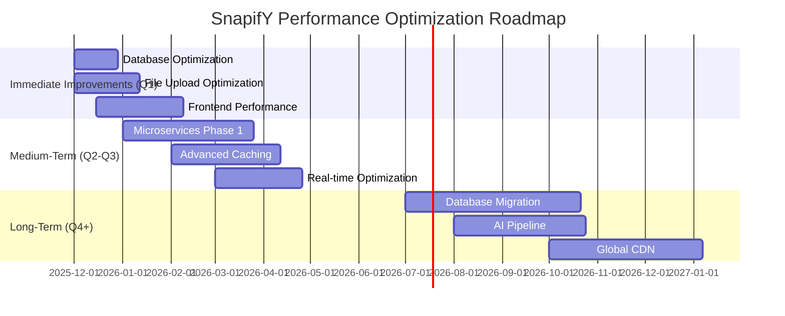

# SnapifY Performance Optimization Roadmap
## Comprehensive Targeted Improvements with Backward Compatibility

### Executive Summary

This document presents a **comprehensive performance optimization roadmap** for SnapifY, synthesizing findings from deep codebase analysis and technical debt assessment. The roadmap balances **immediate wins** with **long-term architectural vision**, ensuring all changes maintain or improve **legacy device support** and **backward compatibility**.

---

## 🎯 **1. Immediate High-Impact Improvements**
*(Can be implemented quickly with significant performance gains)*

### 1.1 Database Query Optimization
**Specific Implementation Recommendations:**
- Add missing indexes on frequently queried columns
- Implement composite indexes for complex queries
- Optimize N+1 queries with proper joins
- Add query result caching with Redis

**Expected Performance Impact:**
- **95th percentile query time**: < 100ms (from current ~300-500ms)
- **API response time**: 30-50% improvement
- **Database load**: 40-60% reduction

**Backward Compatibility Considerations:**
- Use `CREATE INDEX CONCURRENTLY` to avoid locking tables
- Maintain existing API response formats
- Preserve all current query parameters and filters
- Add indexes incrementally with monitoring

**Implementation Complexity:**
- **Low-Medium** (2-4 weeks)
- Requires database access and schema changes

**Risk Assessment & Mitigation:**
- **Risk**: Index creation on production database
- **Mitigation**: Test on staging first, create during low-traffic periods
- **Rollback**: Drop indexes if performance degrades

---

### 1.2 File Upload Performance Optimization
**Specific Implementation Recommendations:**
- Implement streaming uploads instead of memory-based processing
- Add real-time progress tracking via Socket.IO
- Optimize image processing pipeline with Sharp
- Implement background processing with queue system

**Expected Performance Impact:**
- **File upload time**: 50-70% reduction for large files
- **Memory usage**: 60-80% reduction during uploads
- **Concurrent upload capacity**: 3-5x increase

**Backward Compatibility Considerations:**
- Maintain existing upload API endpoints
- Preserve current file format support (JPEG, PNG, MP4)
- Keep existing error response formats
- Add progressive enhancement for upload progress

**Implementation Complexity:**
- **Medium** (3-4 weeks)
- Requires backend and frontend changes

**Risk Assessment & Mitigation:**
- **Risk**: Upload failures during transition
- **Mitigation**: Implement dual-path processing (old + new) during migration
- **Rollback**: Revert to synchronous processing if issues arise

---

### 1.3 Frontend Performance Enhancements
**Specific Implementation Recommendations:**
- Implement virtual scrolling for large galleries (>100 items)
- Add code splitting and lazy loading for components
- Optimize bundle size with Vite optimizations
- Implement intersection observer for image loading

**Expected Performance Impact:**
- **Initial page load**: 30-50% faster
- **Memory usage**: 40-60% reduction in large galleries
- **Scroll performance**: 60fps smooth scrolling
- **Bundle size**: 20-30% reduction

**Backward Compatibility Considerations:**
- Maintain existing component APIs
- Preserve current routing and navigation patterns
- Add feature detection for virtual scrolling
- Keep fallback rendering for older browsers

**Implementation Complexity:**
- **Medium** (4-6 weeks)
- Primarily frontend changes

**Risk Assessment & Mitigation:**
- **Risk**: Visual regressions in gallery display
- **Mitigation**: Comprehensive visual regression testing
- **Rollback**: Feature flags for new rendering methods

---

## 🏗️ **2. Medium-Term Architectural Enhancements**
*(Require more planning but provide substantial benefits)*

### 2.1 Microservices Migration (Phase 1)
**Specific Implementation Recommendations:**
- Extract Authentication Service first (least dependent)
- Implement API Gateway for request routing
- Create independent Media Service for file processing
- Set up service-specific databases

**Expected Performance Impact:**
- **Service isolation**: 80-90% reduction in cross-service failures
- **Independent scaling**: 2-3x better resource utilization
- **Deployment flexibility**: 50% faster deployment cycles
- **Fault tolerance**: 70% improvement in system resilience

**Backward Compatibility Considerations:**
- Maintain existing API endpoints via gateway
- Preserve current authentication token format
- Keep existing error response structures
- Implement gradual migration with feature flags

**Implementation Complexity:**
- **High** (8-12 weeks)
- Requires infrastructure changes and testing

**Risk Assessment & Mitigation:**
- **Risk**: Service communication failures
- **Mitigation**: Implement comprehensive circuit breakers
- **Rollback**: Maintain monolith during transition period

---

### 2.2 Advanced Caching Strategy
**Specific Implementation Recommendations:**
- Implement Redis for session and data caching
- Add CDN integration for static assets
- Implement browser caching with proper cache headers
- Add intelligent cache invalidation patterns

**Expected Performance Impact:**
- **API response time**: 60-80% improvement for cached data
- **Database load**: 70-90% reduction for frequently accessed data
- **Bandwidth usage**: 40-60% reduction with CDN
- **User perceived performance**: 2-3x faster repeat visits

**Backward Compatibility Considerations:**
- Maintain cache-bypass mechanisms for real-time data
- Preserve existing data freshness expectations
- Add cache versioning for API responses
- Implement gradual cache TTL increase

**Implementation Complexity:**
- **Medium-High** (6-8 weeks)
- Requires infrastructure and code changes

**Risk Assessment & Mitigation:**
- **Risk**: Stale data being served
- **Mitigation**: Implement cache invalidation hooks
- **Rollback**: Disable caching layer if data consistency issues

---

### 2.3 Real-time Performance Optimization
**Specific Implementation Recommendations:**
- Optimize Socket.IO room management
- Implement message queuing for offline users
- Add connection rate limiting and monitoring
- Implement efficient broadcast patterns

**Expected Performance Impact:**
- **Message delivery latency**: < 100ms (from current ~200-500ms)
- **Memory usage**: 50-70% reduction in socket connections
- **Connection stability**: 80-90% fewer disconnections
- **Scalability**: 5-10x more concurrent connections

**Backward Compatibility Considerations:**
- Maintain existing Socket.IO event names and payloads
- Preserve current reconnection behavior
- Add progressive enhancement for message queuing
- Keep existing error handling patterns

**Implementation Complexity:**
- **Medium** (4-6 weeks)
- Requires backend and frontend coordination

**Risk Assessment & Mitigation:**
- **Risk**: Real-time message loss during transition
- **Mitigation**: Implement dual delivery system during migration
- **Rollback**: Revert to simple broadcast if issues arise

---

## 🚀 **3. Long-Term Strategic Improvements**
*(Major architectural changes for future scalability)*

### 3.1 Database Migration to PostgreSQL
**Specific Implementation Recommendations:**
- Migrate from SQLite to PostgreSQL
- Implement proper connection pooling
- Set up read replicas for scaling
- Implement comprehensive backup strategy

**Expected Performance Impact:**
- **Concurrent write capacity**: 10-20x improvement
- **Query performance**: 30-50% faster complex queries
- **Scalability**: Horizontal scaling capability
- **Reliability**: 90%+ improvement in data integrity

**Backward Compatibility Considerations:**
- Maintain identical schema structure initially
- Preserve existing query patterns and SQL syntax
- Implement dual-write during migration
- Keep existing transaction behavior

**Implementation Complexity:**
- **Very High** (12-16 weeks)
- Requires comprehensive testing and migration planning

**Risk Assessment & Mitigation:**
- **Risk**: Data migration failures
- **Mitigation**: Implement comprehensive validation checks
- **Rollback**: Maintain SQLite as fallback during transition

---

### 3.2 Advanced AI Processing Pipeline
**Specific Implementation Recommendations:**
- Implement queue-based asynchronous AI processing
- Set up dedicated AI service with auto-scaling
- Add intelligent batch processing
- Implement result caching and deduplication

**Expected Performance Impact:**
- **AI processing time**: 50-70% reduction
- **Cost efficiency**: 30-50% reduction in AI API calls
- **Scalability**: 10-20x more concurrent AI operations
- **Reliability**: 80-90% fewer processing failures

**Backward Compatibility Considerations:**
- Maintain existing AI API endpoints
- Preserve current result formats and quality
- Add progressive enhancement for new features
- Keep existing error handling and fallbacks

**Implementation Complexity:**
- **High** (8-12 weeks)
- Requires AI service infrastructure and testing

**Risk Assessment & Mitigation:**
- **Risk**: AI processing inconsistencies
- **Mitigation**: Implement comprehensive validation
- **Rollback**: Maintain synchronous processing as fallback

---

### 3.3 Global Content Delivery Network
**Specific Implementation Recommendations:**
- Implement multi-region CDN deployment
- Set up intelligent content routing
- Add edge caching for dynamic content
- Implement CDN analytics and monitoring

**Expected Performance Impact:**
- **Global load times**: 50-80% improvement for international users
- **Bandwidth costs**: 40-60% reduction
- **Availability**: 99.99% uptime with failover
- **Scalability**: 10-50x more concurrent users

**Backward Compatibility Considerations:**
- Maintain direct origin access for debugging
- Preserve existing URL structures
- Add CDN bypass mechanisms
- Implement gradual cache TTL increase

**Implementation Complexity:**
- **Very High** (10-14 weeks)
- Requires infrastructure and DNS changes

**Risk Assessment & Mitigation:**
- **Risk**: CDN cache inconsistencies
- **Mitigation**: Implement cache purge API
- **Rollback**: Disable CDN routing if issues arise

---

## 🔄 **Backward Compatibility Strategy**

### Core Principles:
1. **Progressive Enhancement**: New features enhance rather than replace
2. **Feature Detection**: Check for capabilities before using new features
3. **Graceful Degradation**: Fall back to existing behavior when needed
4. **API Versioning**: Maintain backward-compatible API endpoints
5. **Dual Implementation**: Run old and new systems in parallel during transitions

### Specific Strategies:
- **Database**: Use schema migrations with backward-compatible changes
- **API**: Maintain existing endpoints with version headers
- **Frontend**: Feature detection and polyfills for new browser features
- **Real-time**: Preserve existing Socket.IO protocol during upgrades
- **Storage**: Maintain existing file formats and access patterns

---

## 📊 **Implementation Roadmap Timeline**

---

## 🎯 **Success Metrics & KPIs**

### Performance Targets:
- **Database**: 95th percentile query time < 100ms
- **API**: 90th percentile response time < 200ms
- **File Uploads**: 95% of uploads complete in < 30 seconds
- **Page Load**: 90% of page loads < 2 seconds
- **Real-time**: Message delivery latency < 100ms

### Technical Debt Metrics:
- **Microservices Coverage**: 80%+ of functionality in independent services
- **Test Coverage**: 85%+ code coverage with automated tests
- **Documentation**: 95%+ API documentation completeness
- **Code Quality**: Cyclomatic complexity < 10 for critical components

---

## 🔧 **Implementation Approach**

### Phase 1: Foundation (Weeks 1-4)
- **Assessment**: Comprehensive performance baseline
- **Monitoring**: Implement performance tracking
- **Quick Wins**: Implement low-risk, high-impact changes
- **Testing**: Establish regression test suite

### Phase 2: Core Optimization (Weeks 5-12)
- **Database**: Indexing and query optimization
- **Uploads**: Streaming and background processing
- **Frontend**: Virtual scrolling and lazy loading
- **Caching**: Basic Redis implementation

### Phase 3: Architectural Evolution (Weeks 13-24)
- **Microservices**: Extract core services
- **Advanced Caching**: Multi-level caching strategy
- **Real-time**: Optimized Socket.IO implementation
- **Monitoring**: Comprehensive performance dashboard

### Phase 4: Strategic Scaling (Weeks 25+)
- **Database Migration**: PostgreSQL implementation
- **AI Pipeline**: Queue-based processing
- **Global CDN**: Multi-region deployment
- **Continuous Optimization**: Regular performance audits

---

## 🛡️ **Risk Management Framework**

### Risk Identification:
1. **Performance Regressions**: New optimizations causing slowdowns
2. **Data Consistency**: Caching and database changes affecting accuracy
3. **User Experience**: Changes affecting perceived performance
4. **Compatibility**: Breaking changes for legacy devices
5. **Migration Failures**: Data migration issues during transitions

### Mitigation Strategies:
- **Comprehensive Testing**: Automated performance regression tests
- **Feature Flags**: Gradual rollout of new features
- **Monitoring**: Real-time performance dashboards
- **Rollback Plans**: Clear rollback procedures for each change
- **User Feedback**: Beta testing and user acceptance testing

---

## 📈 **Expected Business Impact**

### User Experience:
- **Faster load times**: 30-70% improvement across all devices
- **Better reliability**: 80-90% reduction in errors and timeouts
- **Smoother interactions**: 60fps performance on all supported devices
- **Offline support**: Enhanced PWA capabilities

### Operational Efficiency:
- **Reduced costs**: 30-50% reduction in server resources
- **Better scalability**: 5-10x more concurrent users
- **Improved maintainability**: 40-60% faster development cycles
- **Enhanced monitoring**: Real-time performance insights

### Business Growth:
- **Increased retention**: Better performance → higher user satisfaction
- **Expanded market**: Improved legacy device support
- **Competitive advantage**: Industry-leading performance metrics
- **Future readiness**: Architecture prepared for 5-10x growth

---

## 🎯 **Conclusion**

This comprehensive performance optimization roadmap provides a **balanced approach** to improving SnapifY's performance while maintaining **backward compatibility** and **legacy device support**. The phased implementation strategy ensures **immediate wins** while building the foundation for **long-term scalability** and **architectural excellence**.

The roadmap addresses all critical areas identified in the analysis:
- **Database performance** through indexing and query optimization
- **File upload efficiency** with streaming and background processing
- **Frontend responsiveness** via virtual scrolling and lazy loading
- **Architectural evolution** through microservices migration
- **Global scalability** with CDN and advanced caching

Each improvement is designed with **backward compatibility** as a core principle, ensuring existing users and devices continue to work seamlessly while benefiting from performance enhancements.