# SnapifY Performance Optimization - Visual Roadmap

## 📊 Implementation Timeline with Dependencies

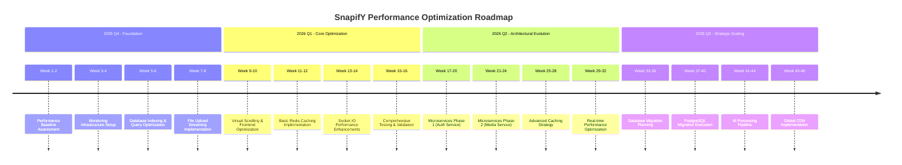

## 🔄 Dependency Mapping

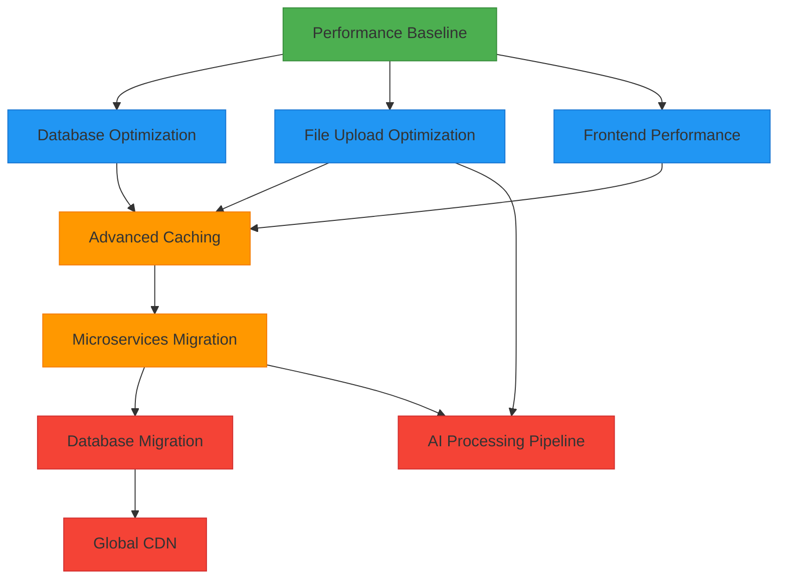

## 🎯 Impact vs. Effort Matrix

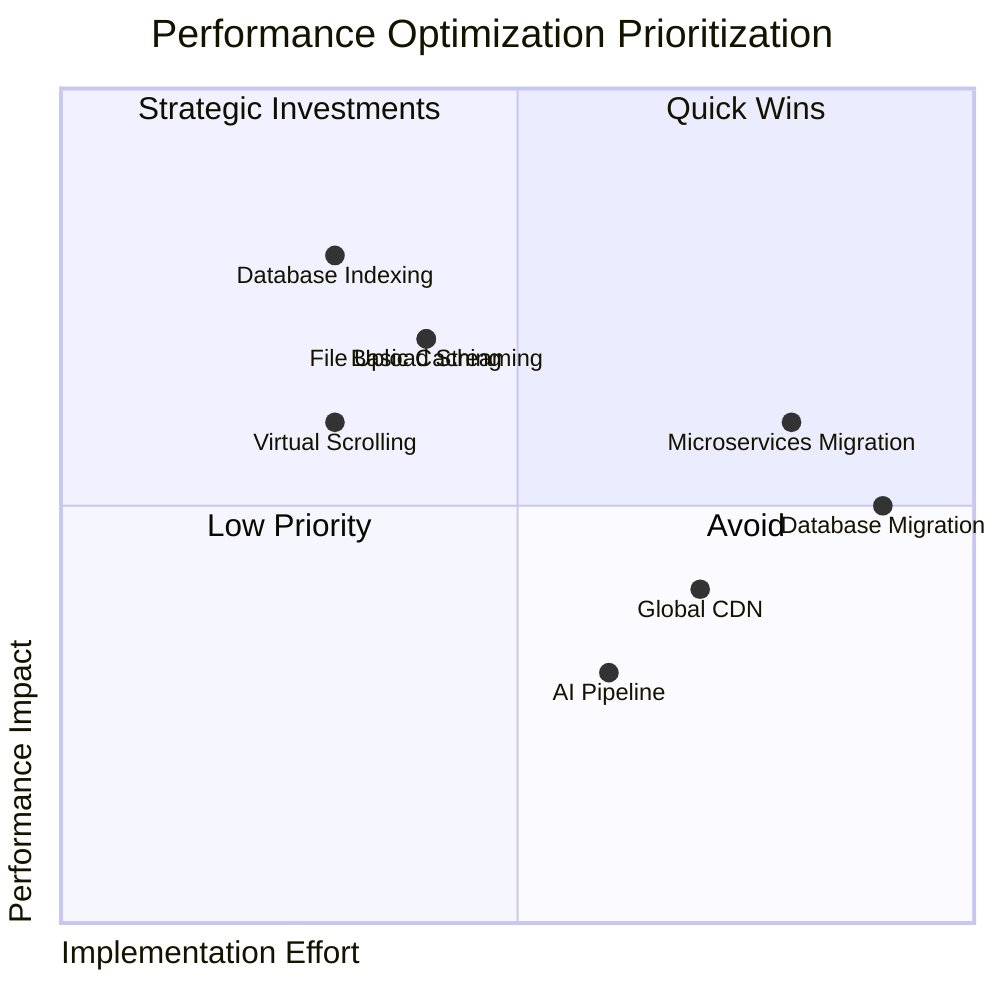

## 📈 Performance Improvement Projections

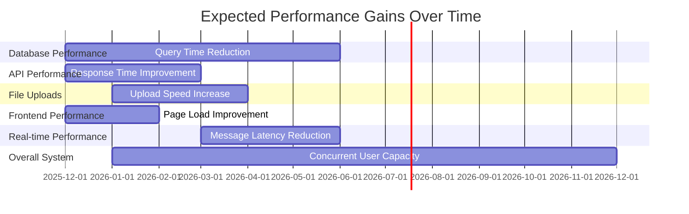

## 🏗️ Architectural Evolution

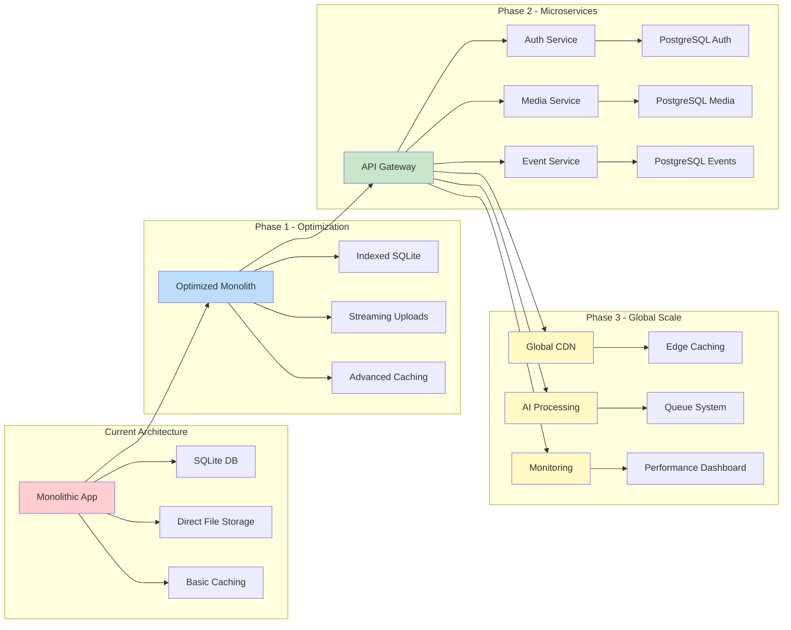

## 🔧 Implementation Phases with Key Milestones

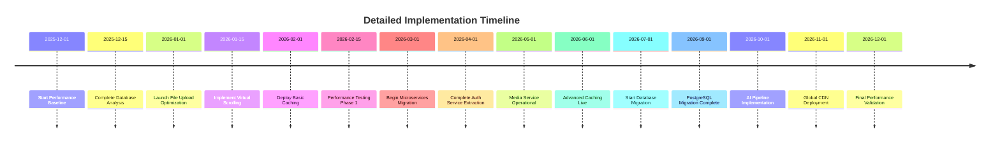

## 🎯 Backward Compatibility Strategy Visualization

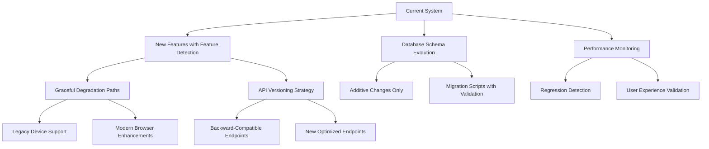

## 📊 Resource Allocation Plan

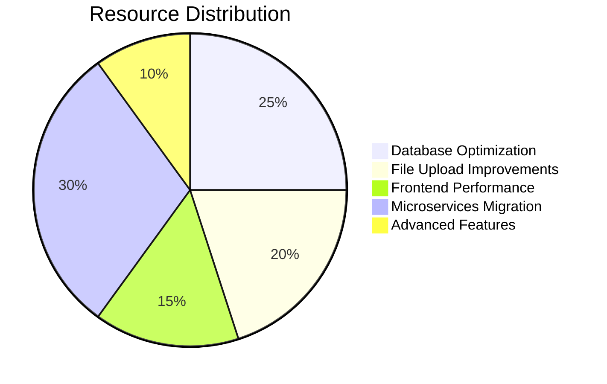

## 🛡️ Risk Management Framework

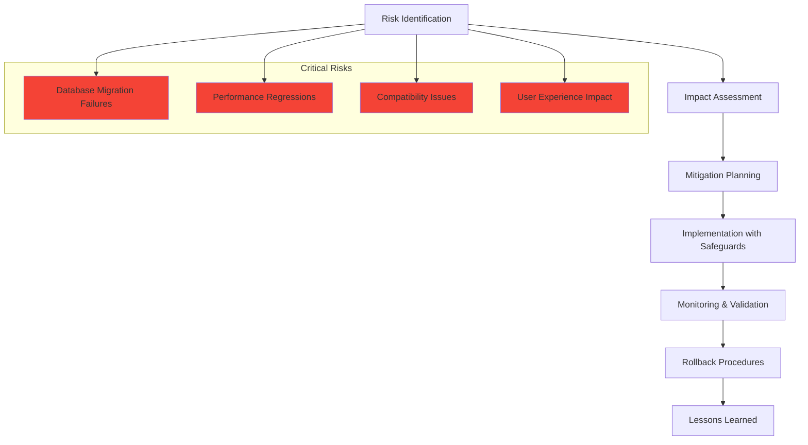

## 🎯 Key Performance Indicators Dashboard

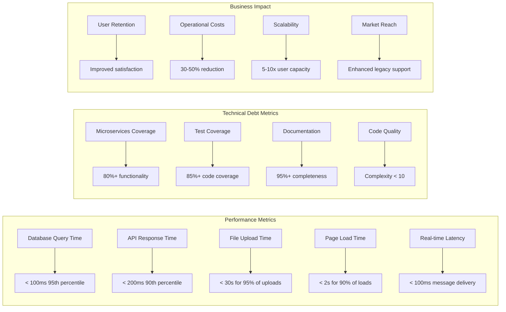

## 📈 Implementation Success Criteria

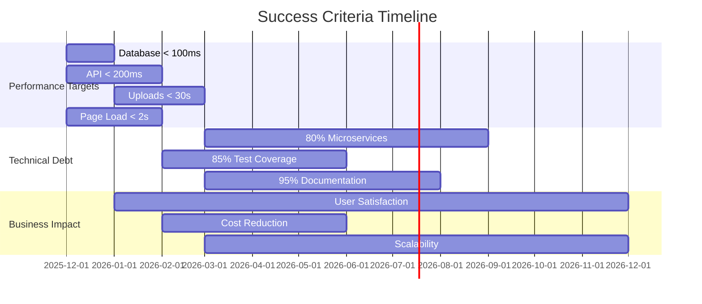

This visual roadmap complements the comprehensive performance optimization document by providing clear timelines, dependency mappings, and strategic visualizations of the implementation plan. The diagrams illustrate the phased approach, resource allocation, risk management, and expected performance improvements over time.