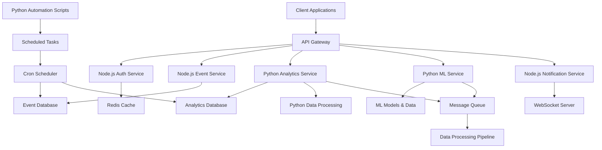
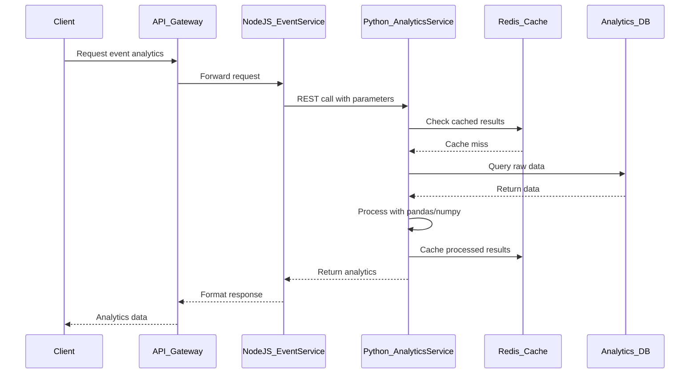
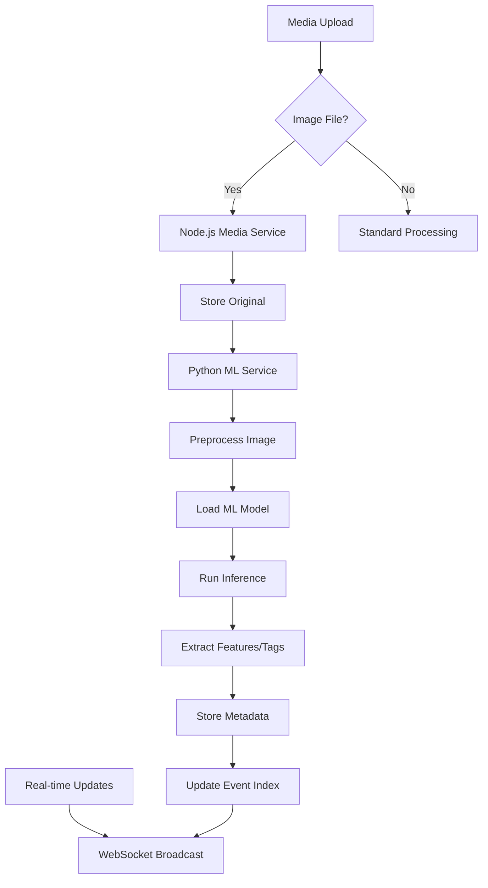

# Python Integration Strategy for SnapifY Web Application

## Executive Summary

This document outlines a practical strategy for integrating Python into the SnapifY web application, leveraging Python's strengths in data science, machine learning, artificial intelligence, analytics, and automation scripting while maintaining compatibility with the existing Node.js/TypeScript stack.

## Current Architecture Context

SnapifY employs a microservices architecture with Node.js/TypeScript backend, SQLite databases, Redis caching, and real-time WebSocket communication. The system handles event management, media processing, user authentication, and notifications. Existing integrations include Rust for image processing and planned Java/C++ services for enterprise features.

## Use Cases for Python Integration

### 1. Data Analytics and Business Intelligence
- **Real-time Event Analytics**: Processing event engagement metrics, user behavior patterns, and performance statistics
- **User Segmentation**: Clustering users based on activity patterns, preferences, and demographics
- **Predictive Analytics**: Forecasting event popularity, user retention, and system load patterns
- **Business Intelligence Dashboards**: Automated report generation and KPI calculations

### 2. Machine Learning and AI Features
- **Image Recognition**: Auto-tagging photos with objects, scenes, and facial recognition
- **Content Recommendation**: Suggesting relevant events and photos to users
- **Sentiment Analysis**: Analyzing guest comments and feedback for insights
- **Anomaly Detection**: Identifying unusual usage patterns or potential security issues

### 3. Automation and Scripting
- **Scheduled Tasks**: Automated data cleanup, backup operations, and maintenance scripts
- **Batch Processing**: ETL pipelines for data aggregation and transformation
- **Notification Automation**: Intelligent email campaigns and personalized messaging
- **Admin Tools**: Command-line utilities for system administration and data migration

### 4. Advanced Data Processing
- **Time Series Analysis**: Event trend analysis and seasonal pattern detection
- **Natural Language Processing**: Processing user-generated content and comments
- **Computer Vision**: Advanced image analysis beyond basic processing
- **Statistical Modeling**: A/B testing analysis and experimental design

## Performance Advantages

### Python Ecosystem Benefits
- **Data Science Libraries**: NumPy, Pandas, SciPy for efficient data manipulation and analysis
- **Machine Learning Frameworks**: Scikit-learn, TensorFlow, PyTorch for AI/ML capabilities
- **Visualization Tools**: Matplotlib, Seaborn, Plotly for data visualization and reporting
- **Async Capabilities**: Asyncio for handling I/O-bound operations efficiently

### Development Productivity
- **Rapid Prototyping**: Quick iteration and experimentation with data models
- **Rich Libraries**: Extensive ecosystem for specialized tasks (NLP, CV, statistics)
- **Interpreted Language**: No compilation step, faster development cycles
- **Integration Ease**: Seamless calling from Node.js applications

### Scalability Enhancements
- **Horizontal Scaling**: Containerized Python services can scale independently
- **Resource Optimization**: Efficient memory management for data-intensive tasks
- **Background Processing**: Async task queues for non-blocking operations
- **Caching Integration**: Redis integration for performance optimization

## Integration Methods

### 1. Side-by-Side Microservices
Deploy Python services alongside existing Node.js services with communication via:
- REST APIs for synchronous operations
- Message queues (Redis pub/sub) for asynchronous processing
- Shared databases with proper data synchronization
- gRPC for high-performance inter-service communication

### 2. Hybrid Architecture Approach
- **Node.js Layer**: Real-time features, lightweight APIs, and client communication
- **Python Layer**: Data processing, ML inference, and analytics workloads
- **API Gateway**: Unified entry point routing requests to appropriate services
- **Event-Driven**: Message queues for decoupling services

### 3. Scripting Integration
- **Command-Line Tools**: Python scripts executed via Node.js child_process
- **Admin Interfaces**: Web-based interfaces calling Python automation scripts
- **Scheduled Jobs**: Cron-like execution of Python maintenance tasks
- **Data Migration**: Python scripts for database transformations and ETL operations

### 4. Containerized Deployment
- **Docker Integration**: Containerize Python services for consistent deployment
- **Orchestration**: Kubernetes or Docker Compose for service management
- **CI/CD Integration**: Automated testing and deployment pipelines
- **Environment Management**: Virtual environments and dependency isolation

## Trade-offs and Considerations

### Advantages
- Unparalleled data science and ML capabilities
- Rapid development and prototyping
- Rich ecosystem of specialized libraries
- Excellent integration with existing Node.js stack

### Challenges
- **GIL Limitations**: Global Interpreter Lock affects multi-threading for CPU-bound tasks
- **Memory Usage**: Higher memory footprint compared to Node.js
- **Startup Time**: Slower cold starts for services
- **Dependency Management**: Complex package management (pip, conda, requirements.txt)

### Mitigation Strategies
- **Async Processing**: Use async/await for I/O-bound operations
- **Microservices**: Deploy separate Python processes for different workloads
- **Caching**: Leverage Redis for performance optimization
- **Profiling**: Monitor and optimize resource usage

## Code Examples

### FastAPI Analytics Microservice

```python
from fastapi import FastAPI, HTTPException
from pydantic import BaseModel
import pandas as pd
import numpy as np
from typing import List, Dict
import redis
import json

app = FastAPI(title="Snapify Analytics Service")
redis_client = redis.Redis(host='localhost', port=6379, decode_responses=True)

class EventAnalyticsRequest(BaseModel):
    event_id: str
    start_date: str
    end_date: str

class AnalyticsResponse(BaseModel):
    total_views: int
    total_uploads: int
    engagement_rate: float
    peak_hours: List[int]
    user_demographics: Dict[str, int]

@app.post("/api/analytics/event", response_model=AnalyticsResponse)
async def get_event_analytics(request: EventAnalyticsRequest):
    try:
        # Fetch data from Redis cache or database
        cache_key = f"analytics:{request.event_id}:{request.start_date}:{request.end_date}"
        cached_data = redis_client.get(cache_key)

        if cached_data:
            return json.loads(cached_data)

        # Process analytics with pandas
        # (Mock data processing - replace with actual database queries)
        df = pd.DataFrame({
            'timestamp': pd.date_range(request.start_date, request.end_date, freq='H'),
            'views': np.random.poisson(10, 24),
            'uploads': np.random.poisson(2, 24)
        })

        analytics = {
            'total_views': int(df['views'].sum()),
            'total_uploads': int(df['uploads'].sum()),
            'engagement_rate': float(df['uploads'].sum() / df['views'].sum()),
            'peak_hours': df.groupby(df['timestamp'].dt.hour)['views'].sum().nlargest(3).index.tolist(),
            'user_demographics': {'18-24': 25, '25-34': 35, '35-44': 25, '45+': 15}
        }

        # Cache results
        redis_client.setex(cache_key, 3600, json.dumps(analytics))

        return analytics

    except Exception as e:
        raise HTTPException(status_code=500, detail=str(e))
```

### ML Service for Image Analysis

```python
from fastapi import FastAPI, File, UploadFile
from PIL import Image
import io
import torch
import torchvision.transforms as transforms
from torchvision.models import resnet50
import json

app = FastAPI(title="Snapify ML Service")

# Load pre-trained model
model = resnet50(pretrained=True)
model.eval()

# Image preprocessing
preprocess = transforms.Compose([
    transforms.Resize(256),
    transforms.CenterCrop(224),
    transforms.ToTensor(),
    transforms.Normalize(mean=[0.485, 0.456, 0.406], std=[0.229, 0.224, 0.225]),
])

# ImageNet class labels (simplified)
with open('imagenet_classes.json', 'r') as f:
    class_labels = json.load(f)

@app.post("/api/ml/analyze-image")
async def analyze_image(file: UploadFile = File(...)):
    try:
        # Read and preprocess image
        image_data = await file.read()
        image = Image.open(io.BytesIO(image_data)).convert('RGB')
        input_tensor = preprocess(image)
        input_batch = input_tensor.unsqueeze(0)

        # Run inference
        with torch.no_grad():
            output = model(input_batch)
            probabilities = torch.nn.functional.softmax(output[0], dim=0)

        # Get top predictions
        top5_prob, top5_catid = torch.topk(probabilities, 5)
        predictions = []
        for i in range(top5_prob.size(0)):
            predictions.append({
                'label': class_labels[top5_catid[i].item()],
                'confidence': top5_prob[i].item()
            })

        return {
            'predictions': predictions,
            'processing_time': 0.15  # Mock processing time
        }

    except Exception as e:
        return {'error': str(e)}
```

### Node.js Integration with Python Service

```javascript
// Node.js service calling Python analytics microservice
const axios = require('axios');

class AnalyticsService {
    constructor() {
        this.pythonServiceUrl = process.env.PYTHON_ANALYTICS_URL || 'http://localhost:8000';
    }

    async getEventAnalytics(eventId, startDate, endDate) {
        try {
            const response = await axios.post(`${this.pythonServiceUrl}/api/analytics/event`, {
                event_id: eventId,
                start_date: startDate,
                end_date: endDate
            });

            return response.data;
        } catch (error) {
            console.error('Python analytics service error:', error.message);
            // Fallback to Node.js processing
            return this.fallbackAnalytics(eventId, startDate, endDate);
        }
    }

    async analyzeImage(imageBuffer) {
        try {
            const formData = new FormData();
            formData.append('file', imageBuffer, 'image.jpg');

            const response = await axios.post(`${this.pythonServiceUrl}/api/ml/analyze-image`, formData, {
                headers: { 'Content-Type': 'multipart/form-data' }
            });

            return response.data;
        } catch (error) {
            console.error('Python ML service error:', error.message);
            return { predictions: [], error: 'Service unavailable' };
        }
    }

    fallbackAnalytics(eventId, startDate, endDate) {
        // Basic analytics calculation in Node.js
        return {
            total_views: 0,
            total_uploads: 0,
            engagement_rate: 0,
            peak_hours: [],
            user_demographics: {}
        };
    }
}

module.exports = AnalyticsService;
```

### Automation Script Example

```python
#!/usr/bin/env python3
"""
Snapify Data Cleanup Automation Script
Usage: python cleanup.py --dry-run
"""

import argparse
import sqlite3
import os
from datetime import datetime, timedelta
import logging

logging.basicConfig(level=logging.INFO)
logger = logging.getLogger(__name__)

class DataCleanup:
    def __init__(self, db_path: str, dry_run: bool = False):
        self.db_path = db_path
        self.dry_run = dry_run
        self.conn = None

    def connect(self):
        self.conn = sqlite3.connect(self.db_path)

    def disconnect(self):
        if self.conn:
            self.conn.close()

    def cleanup_expired_events(self, days_old: int = 30):
        """Remove events older than specified days"""
        cutoff_date = datetime.now() - timedelta(days=days_old)

        query = """
        SELECT id, title, created_at FROM events
        WHERE created_at < ? AND status = 'expired'
        """

        cursor = self.conn.cursor()
        cursor.execute(query, (cutoff_date.isoformat(),))
        expired_events = cursor.fetchall()

        if self.dry_run:
            logger.info(f"Would delete {len(expired_events)} expired events")
            for event in expired_events[:5]:  # Show first 5
                logger.info(f"  - {event[1]} (created: {event[2]})")
        else:
            # Delete associated media first
            for event in expired_events:
                cursor.execute("DELETE FROM media WHERE event_id = ?", (event[0],))

            # Delete events
            cursor.execute("DELETE FROM events WHERE created_at < ? AND status = 'expired'",
                         (cutoff_date.isoformat(),))

            self.conn.commit()
            logger.info(f"Deleted {len(expired_events)} expired events")

        return len(expired_events)

    def cleanup_orphaned_media(self):
        """Remove media files not associated with any event"""
        query = """
        SELECT m.id, m.filename FROM media m
        LEFT JOIN events e ON m.event_id = e.id
        WHERE e.id IS NULL
        """

        cursor = self.conn.cursor()
        cursor.execute(query)
        orphaned_media = cursor.fetchall()

        if self.dry_run:
            logger.info(f"Would delete {len(orphaned_media)} orphaned media records")
        else:
            for media in orphaned_media:
                # Remove file from storage
                file_path = f"/path/to/uploads/{media[1]}"
                if os.path.exists(file_path):
                    os.remove(file_path)

                # Remove database record
                cursor.execute("DELETE FROM media WHERE id = ?", (media[0],))

            self.conn.commit()
            logger.info(f"Deleted {len(orphaned_media)} orphaned media records")

        return len(orphaned_media)

    def run_cleanup(self):
        """Run all cleanup operations"""
        logger.info("Starting data cleanup...")
        logger.info(f"Dry run: {self.dry_run}")

        self.connect()

        try:
            expired_count = self.cleanup_expired_events()
            orphaned_count = self.cleanup_orphaned_media()

            logger.info(f"Cleanup complete: {expired_count} events, {orphaned_count} media files")

        finally:
            self.disconnect()

def main():
    parser = argparse.ArgumentParser(description='Snapify data cleanup utility')
    parser.add_argument('--dry-run', action='store_true', help='Show what would be deleted without actually deleting')
    parser.add_argument('--db-path', default='./database.sqlite', help='Path to SQLite database')

    args = parser.parse_args()

    cleanup = DataCleanup(args.db_path, args.dry_run)
    cleanup.run_cleanup()

if __name__ == '__main__':
    main()
```

## Architectural Diagrams

### Integrated Microservices Architecture with Python



### Data Flow with Python Analytics Integration



### ML Processing Pipeline



## Implementation Roadmap

### Phase 1: Foundation (1-2 months)
- Set up Python development environment and virtual environments
- Create pilot analytics microservice for basic event statistics
- Establish communication patterns with existing Node.js services
- Implement basic automation scripts for data maintenance

### Phase 2: Core Integration (2-4 months)
- Deploy ML service for image analysis and auto-tagging
- Implement comprehensive analytics dashboard backend
- Add automation framework for scheduled tasks
- Integrate message queue processing for async operations

### Phase 3: Advanced Features (1-2 months)
- Implement recommendation engine using collaborative filtering
- Add natural language processing for comment analysis
- Develop predictive analytics for user engagement
- Optimize performance and add comprehensive monitoring

### Phase 4: Production Optimization (1-2 months)
- Performance tuning and resource optimization
- Security hardening and access controls
- Comprehensive testing and validation
- Documentation and team training

## Conclusion

Integrating Python into SnapifY provides transformative capabilities in data science, machine learning, and automation while maintaining the real-time performance of the existing Node.js architecture. The microservices approach allows gradual adoption with minimal risk, enabling the platform to leverage Python's strengths where most beneficial.

Key success factors include starting with pilot analytics services, establishing clear API contracts, and maintaining comprehensive monitoring across the polyglot architecture. This strategy positions SnapifY for data-driven growth while preserving its event sharing core functionality.